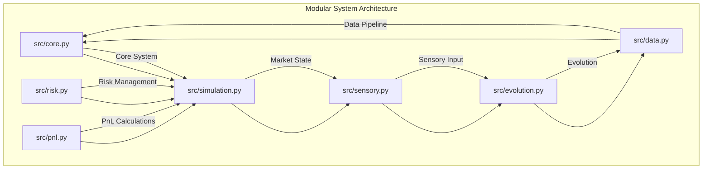

# EMP Proving Ground v2.0 - Modular Evolutionary Trading System

### An Adversarial Simulation Environment for Forging Antifragile Trading Organisms


---

The EMP Proving Ground is not just another backtesting engine. It is a **Darwinian crucible** designed to solve the fundamental problem of algorithmic trading: **static strategies fail in dynamic markets.**

Traditional trading bots are brittle; they are optimized for a specific set of historical patterns and break as soon as the market regime changes or they encounter sophisticated manipulation. The EMP project takes a different approach. We don't code trading strategies; we create the conditions for them to **emerge** through evolution.

## Core Philosophy: The Antifragile Predator

This system is built on a set of first principles derived from our collaborative AI brain trust:

1. **Evolution over Optimization:** We don't curve-fit. We use genetic programming to run a "digital natural selection" where populations of random trading strategies (genomes) compete. Only the fittest—those that are profitable, robust, and adaptive—survive to reproduce.

2. **Adversarial by Design:** The market is a hostile, adversarial environment. To prepare our organisms, the Proving Ground is not a peaceful garden but a deadly arena. A **Cunning Adversarial Engine** actively tries to trick, trap, and destroy the trading genomes by simulating real-world manipulation tactics like stop hunts and spoofing.

3. **Resilience as the Ultimate Goal:** A profitable but fragile strategy is useless. Our **Multi-Objective Fitness Function** rewards genomes not just for high returns, but for their ability to withstand attacks, perform consistently across different market conditions, and manage risk intelligently.

4. **Intelligence as an Emergent Property:** We do not hard-code trading patterns like the "London Sweep." Instead, we provide the EMP with the sensory tools to perceive the market (`4D+1 Sensory Cortex`) and let it discover which patterns are truly effective through thousands of generations of trial and error.

---

## 🏛️ Architecture Overview

The EMP Proving Ground v2.0 is a modular system where each component plays a critical role in the evolutionary process.



## 🚀 Features

### Core Components
- **Core System** (`src/core.py`): Central system components and utilities
- **Risk Management** (`src/risk.py`): Position sizing, risk limits, and validation
- **PnL Engine** (`src/pnl.py`): Profit/loss calculations and trade tracking
- **Data Pipeline** (`src/data.py`): Market data ingestion, cleaning, and storage
- **Sensory Cortex** (`src/sensory.py`): 4D+1 perception system for market analysis
- **Evolution Engine** (`src/evolution.py`): Genetic algorithm and population management
- **Market Simulation** (`src/simulation.py`): Realistic trading environment with adversarial events

### Advanced Features
- **Adversarial Testing**: Intelligent market manipulation and stop hunting
- **Regime Detection**: Automatic identification of market regimes
- **Multi-Objective Fitness**: Comprehensive evaluation across returns, robustness, adaptability, efficiency, and antifragility
- **Synthetic Data Generation**: Realistic market data for testing
- **Checkpoint System**: Save and resume evolution progress

### ✨ Key Features
- **High-Fidelity Market Simulator**: Replays real historical tick data with realistic, dynamic spreads, commissions, slippage, and market impact modeling.
- **Cunning Adversarial Engine**: Goes beyond random noise to implement intelligent, context-aware manipulation tactics.
- **Liquidity Zone Hunter**: Identifies likely stop-loss clusters and executes targeted stop hunts.
- **Breakout Trap Spoofing**: Detects price consolidations and engineers fake breakouts to trap predictable algorithms.
- **"Triathlon" Fitness Evaluation**: A groundbreaking anti-overfitting mechanism. Every genome is tested across three distinct, pre-identified historical market regimes: Trending, Ranging, and Volatile/Crisis.
- **Multi-Objective Fitness Function**: The final fitness score is a sophisticated blend of Sortino Ratio, Calmar Ratio, Profit Factor, and a critical Robustness Score derived from performance under adversarial attack.
- **Genetic Programming Core**: Trading strategies are represented as evolvable Decision Trees, allowing for the emergence of complex, interpretable logic.
- **4D+1 Sensory Cortex**: The "brain" of each organism, which perceives the market through five key dimensions: WHY (Macro), HOW (Institutional), WHAT (Technical), WHEN (Session/Time), and ANOMALY (Manipulation).

## 🛠️ Tech Stack

- **Python 3.10+**: Core programming language
- **Pandas & NumPy**: Data manipulation and numerical computing
- **SciPy & Scikit-learn**: Scientific computing and machine learning
- **PyYAML**: Configuration management
- **Matplotlib & Seaborn**: Data visualization
- **PyArrow**: High-performance data storage

## 📋 Prerequisites

- Python 3.10+
- Required packages (see `requirements.txt`)

## 🚀 Quick Start

### 1. Install Dependencies
```bash
pip install -r requirements.txt
```

### 2. Run the System
```bash
python main.py
```

This will execute the complete EMP Proving Ground system with demonstrations of all components.

## ⚙️ Configuration

The system is configured through `config.yaml`:

```yaml
data:
  raw_dir: data/raw
  processed_dir: data/processed
  symbol: EURUSD
  start_year: 2018
  end_year: 2024

simulation:
  commission_per_trade: 0.0001  # 1 pip
  base_slippage_bps: 0.5
  size_impact_factor: 0.1
  volatility_factor: 0.2
  initial_balance: 100000
  leverage: 1.0

evolution:
  population_size: 50
  generations: 10
  elite_ratio: 0.1
  crossover_ratio: 0.8
  mutation_ratio: 0.1
  mutation_rate: 0.1

adversary:
  enabled: true
  intensity: 0.7
```

## 📊 Project Structure

```
EMP/
├── src/                    # Core modular system
│   ├── __init__.py
│   ├── core.py            # Core system components
│   ├── risk.py            # Risk management
│   ├── pnl.py             # PnL calculations
│   ├── data.py            # Data handling
│   ├── sensory.py         # Sensory cortex
│   ├── evolution.py       # Evolution engine
│   └── simulation.py      # Market simulation
├── main.py                 # Main entry point
├── config.yaml             # Configuration
├── configs/                # Configuration files
├── scripts/                # Utility scripts
├── data/                   # Data directory
├── experiments/            # Experiment results
├── archive/                # Legacy files (safely stored)
├── requirements.txt        # Dependencies
└── README.md              # This file
```

## 🔄 Development Workflow

1. **Data Preparation**: Use `scripts/create_test_data.py` to generate synthetic data
2. **System Testing**: Run `python main.py` to test all components
3. **Configuration**: Modify `config.yaml` for different experiments
4. **Results**: Check `experiments/` directory for outputs

## 📈 Expected Outputs

The system generates comprehensive outputs including:
- Real-time fitness metrics
- Evolution progress tracking
- Performance analysis across market regimes
- Adversarial event statistics
- Final evolved genomes

## 🔬 Advanced Usage

### Custom Experiments
Modify `config.yaml` to adjust:
- Population size and generations
- Adversarial intensity levels
- Market regime datasets
- Fitness function weights

### Data Sources
- Use `scripts/download_data.py` for real market data
- Use `scripts/create_test_data.py` for synthetic data
- Configure data sources in `configs/`

## 🗺️ Development Roadmap

- [x] **Phase 0: Modular Refactor** - Complete structural reorganization
- [x] **Phase 1: Core System** - Basic modular components
- [ ] **Phase 2: Financial Core** - Robust risk management and PnL engine
- [ ] **Phase 3: Advanced Features** - Enhanced adversarial engine and sensory cortex
- [ ] **Phase 4: Live Integration** - Paper trading and real-world validation

## 🤝 Contributing

This is a rigorously engineered system. Please adhere to the following standards:

* **Follow the Modular Architecture**: Keep logic within the appropriate components
* **Write Tests**: All new code must be accompanied by comprehensive tests
* **Maintain Code Quality**: Use proper formatting and type checking
* **Document Everything**: Update this README and add docstrings for all public methods

## 📚 References

* **Evolutionary Algorithms**: Genetic programming for trading strategies
* **Market Microstructure**: Realistic market simulation
* **Adversarial Testing**: Robustness evaluation techniques
* **Multi-Objective Optimization**: Pareto-optimal solution finding

## 📄 License

This project is licensed under the MIT License - see the LICENSE file for details.

## 🙏 Acknowledgments

* Dukascopy for providing market data
* Scientific community for evolutionary algorithm research
* Open source contributors for supporting libraries

---

**EMP Proving Ground v2.0** - Pushing the boundaries of evolutionary trading systems with a clean, modular architecture.
