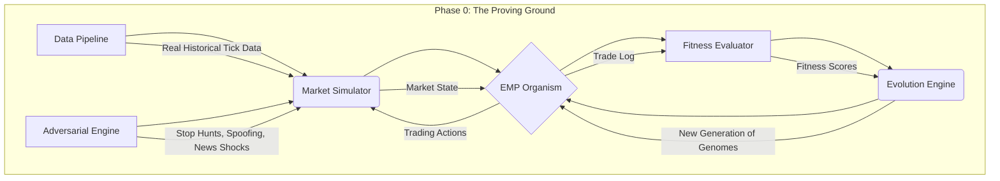

<<<<<<< HEAD
# EMP Proving Ground v2.0 - Pilot Experiment
## Operation Phased Explosion - Phase 1: Shake-down Cruise

This repository contains the complete implementation of the EMP Proving Ground v2.0 pilot experiment as specified in the Prime Directive. The system implements an intelligent adversarial engine with triathlon evaluation across three distinct market regimes.

## 🎯 Objective

To validate the stability of our v2.0 system and confirm that our evolutionary process can generate a positive fitness trend from a random starting population before committing to a large-scale run.

## 🏗️ Architecture Overview

### Core Components
- **Intelligent Adversarial Engine**: Context-aware stop hunting and breakout trap spoofing
- **4D+1 Sensory Cortex**: Multi-dimensional market perception system
- **Decision Tree Genomes**: Evolvable trading logic representation
- **Triathlon Evaluation**: Testing across trending, ranging, and volatile market regimes
- **Multi-Objective Fitness**: Sortino, Calmar, profit factor, consistency, and robustness metrics

### v2.0 Features
- ✅ Liquidity zone detection for intelligent stop hunting
- ✅ Breakout trap spoofing with consolidation analysis
- ✅ Triathlon evaluation across three market regimes
- ✅ Multi-objective fitness with anti-overfitting penalties
- ✅ Parallel execution with checkpointing and real-time logging

## 📋 Prerequisites

- Python 3.8+
- Required packages (see `requirements.txt`)

## 🚀 Quick Start

### 1. Install Dependencies
```bash
pip install -r requirements.txt
```

### 2. Test Configuration
```bash
python test_config.py
```
This validates that the configuration system loads correctly and creates experiment directories.

### 3. Run Pilot Experiment
```bash
python pilot_executor.py
```

## ⚙️ Configuration

The experiment is fully parameterized through `pilot_config.yaml`:

### Key Parameters
- **Population Size**: 100 genomes
- **Generations**: 50 evolutionary cycles
- **Adversarial Levels**: [0.3, 0.5, 0.7] (parallel execution)
- **Regime Datasets**: 
  - Trending (2022-09-01 to 2022-10-01)
  - Ranging (2021-08-01 to 2021-09-01)
  - Volatile (2020-03-01 to 2020-04-01)

### Evolution Hyperparameters
- Elite Ratio: 15%
- Crossover Ratio: 60%
- Mutation Ratio: 25%
- Tournament Size: 4
- Max Tree Depth: 6

## 📊 Expected Outputs

### Directory Structure
```
experiments/
└── Shake-down Cruise_YYYYMMDD_HHMMSS/
    ├── checkpoints/          # Generation checkpoints
    ├── logs/                 # Detailed execution logs
    ├── metrics/              # Real-time CSV metrics
    ├── results/              # Final results and summary
    └── config.yaml           # Saved configuration
```

### Key Files
- **`metrics_0.3.csv`**, **`metrics_0.5.csv`**, **`metrics_0.7.csv`**: Real-time metrics for each difficulty level
- **`final_results.json`**: Complete experiment results
- **`experiment_summary.txt`**: Human-readable summary
- **`checkpoint_*.pkl`**: Generation checkpoints for resumption

## 🔄 Resumption Capability

The system automatically saves checkpoints every 10 generations. If interrupted, the experiment will resume from the latest checkpoint:

```bash
python pilot_executor.py
```

## ✅ Success Criteria Validation

The system automatically validates three critical criteria:

1. **System Stability**: No unhandled exceptions or crashes
2. **Fitness Progression**: At least one difficulty level achieves statistically significant fitness improvement
3. **Behavioral Sanity**: Trap rates remain within [10%, 50%] range

## 📈 Metrics Tracked

### Per Generation
- Best/Average/Worst fitness scores
- Population diversity
- Trap rate (adversarial event frequency)
- Complexity statistics
- Elite count and new genomes

### Final Analysis
- Fitness improvement across difficulty levels
- Regime-specific performance
- Anti-overfitting consistency penalties
- Overall experiment success/failure status
=======
# EMP Proving Ground: Evolving Market Predator
### An Adversarial Simulation Environment for Forging Antifragile Trading Organisms


---

The EMP Proving Ground is not just another backtesting engine. It is a **Darwinian crucible** designed to solve the fundamental problem of algorithmic trading: **static strategies fail in dynamic markets.**

Traditional trading bots are brittle; they are optimized for a specific set of historical patterns and break as soon as the market regime changes or they encounter sophisticated manipulation. The EMP project takes a different approach. We don't code trading strategies; we create the conditions for them to **emerge** through evolution.

## Core Philosophy: The Antifragile Predator

This system is built on a set of first principles derived from our collaborative AI brain trust:

1. **Evolution over Optimization:** We don't curve-fit. We use genetic programming to run a "digital natural selection" where populations of random trading strategies (genomes) compete. Only the fittest—those that are profitable, robust, and adaptive—survive to reproduce.

2. **Adversarial by Design:** The market is a hostile, adversarial environment. To prepare our organisms, the Proving Ground is not a peaceful garden but a deadly arena. A **Cunning Adversarial Engine** actively tries to trick, trap, and destroy the trading genomes by simulating real-world manipulation tactics like stop hunts and spoofing.

3. **Resilience as the Ultimate Goal:** A profitable but fragile strategy is useless. Our **Multi-Objective Fitness Function** rewards genomes not just for high returns, but for their ability to withstand attacks, perform consistently across different market conditions, and manage risk intelligently.

4. **Intelligence as an Emergent Property:** We do not hard-code trading patterns like the "London Sweep." Instead, we provide the EMP with the sensory tools to perceive the market (`4D+1 Sensory Cortex`) and let it discover which patterns are truly effective through thousands of generations of trial and error.

---

## 🏛️ Architecture Overview

The EMP Proving Ground is a modular system where each component plays a critical role in the evolutionary process.



## 🚀 Features

### Core Components
- **Data Pipeline**: Real-time market data ingestion and cleaning
- **Market Simulation**: Realistic trading environment with adversarial events
- **Sensory Cortex**: 4D+1 perception system for market analysis
- **Decision Genome**: Evolutionary decision trees for strategy representation
- **Fitness Evaluation**: Multi-objective fitness scoring across market regimes
- **Evolution Engine**: Population management and genetic algorithm optimization

### Advanced Features
- **Adversarial Testing**: Intelligent market manipulation and stop hunting
- **Regime Detection**: Automatic identification of market regimes
- **Multi-Objective Fitness**: Comprehensive evaluation across returns, robustness, adaptability, efficiency, and antifragility
- **Synthetic Data Generation**: Realistic market data for testing
- **Checkpoint System**: Save and resume evolution progress

### ✨ Key Features
- **High-Fidelity Market Simulator**: Replays real historical tick data with realistic, dynamic spreads, commissions, slippage, and market impact modeling.
- **Cunning Adversarial Engine**: Goes beyond random noise to implement intelligent, context-aware manipulation tactics.
- **Liquidity Zone Hunter**: Identifies likely stop-loss clusters and executes targeted stop hunts.
- **Breakout Trap Spoofing**: Detects price consolidations and engineers fake breakouts to trap predictable algorithms.
- **"Triathlon" Fitness Evaluation**: A groundbreaking anti-overfitting mechanism. Every genome is tested across three distinct, pre-identified historical market regimes: Trending, Ranging, and Volatile/Crisis.
- **Multi-Objective Fitness Function**: The final fitness score is a sophisticated blend of Sortino Ratio, Calmar Ratio, Profit Factor, and a critical Robustness Score derived from performance under adversarial attack.
- **Genetic Programming Core**: Trading strategies are represented as evolvable Decision Trees, allowing for the emergence of complex, interpretable logic.
- **4D+1 Sensory Cortex**: The "brain" of each organism, which perceives the market through five key dimensions: WHY (Macro), HOW (Institutional), WHAT (Technical), WHEN (Session/Time), and ANOMALY (Manipulation).

## 🛠️ Tech Stack

- **Core Language**: Python 3.10+
- **Data Processing**: Pandas, NumPy, PyArrow (for Parquet)
- **Machine Learning**: Scikit-learn, SciPy
- **Data Ingestion**: duka library for Dukascopy tick data
- **Dependency Management**: pip/requirements.txt
- **Testing**: pytest
- **Visualization**: Matplotlib, Seaborn

## 📁 Project Structure

```
emp_proving_ground_v1/
├── emp/
│   ├── data_pipeline/
│   │   ├── ingestor.py       # Dukascopy data ingestion
│   │   ├── cleaner.py        # Tick data cleaning
│   │   ├── storage.py        # Data storage and caching
│   │   └── regime_identifier.py # Market regime identification
│   ├── simulation/
│   │   ├── simulator.py      # Market simulator
│   │   └── adversary.py      # Adversarial engine
│   ├── agent/
│   │   ├── sensory.py        # 4D+1 sensory cortex
│   │   └── genome.py         # Decision genome
│   └── evolution/
│       ├── fitness.py        # Fitness evaluator
│       └── engine.py         # Evolution engine
├── scripts/                  # Utility scripts
├── tests/                    # Test files
├── run_evolution.py          # Main execution script
├── requirements.txt          # Dependencies
├── config.yaml              # Configuration file
└── README.md               # This file
```

## 🚀 Getting Started

### 1. Prerequisites
- Git
- Python 3.10 or higher
- pip for package management

### 2. Installation

```bash
# 1. Clone the repository
git clone <your-repo-url>
cd emp_proving_ground_v1

# 2. Install dependencies
pip install -r requirements.txt
```

### 3. Configuration
All system parameters are managed in a central `config.yaml` file.

```bash
# Copy the example configuration (if available)
cp config.yaml.example config.yaml
```

Review and edit `config.yaml` as needed. The defaults are set for the "Shake-down Cruise" pilot experiment.

### 4. Data Ingestion (Critical First Step)
The Proving Ground requires real historical data to function. The system is designed to fail if real data is not present.

**Download Historical Data:**
Run the ingestion script to download and process tick data for the required years. This step can take a significant amount of time and disk space.

```bash
# Download data for the three required regime years
python run_evolution.py --mode download --symbols EURUSD --years 2022
python run_evolution.py --mode download --symbols EURUSD --years 2021
python run_evolution.py --mode download --symbols EURUSD --years 2020
```

**Identify Market Regimes:**
Once the data is downloaded, run the regime identification script. This analyzes the full dataset and creates regimes.json, which is required by the Fitness Evaluator.

```bash
python run_evolution.py --mode regimes --symbols EURUSD --start-year 2020 --end-year 2022
```

## 🔬 Usage: Running an Experiment

The primary entry point for running an evolutionary simulation is `run_evolution.py`.

### Running a "Smoke Test"
Before launching a full run, it's highly recommended to run a small-scale "smoke test" to ensure all components are working.

```bash
# Run a 3-generation simulation with a population of 10
python run_evolution.py --mode evolution --population-size 10 --max-generations 3 --output-dir results/smoke_test
```

### Running the Full "Shake-down Cruise" Pilot
This executes the official Phase 1 pilot experiment as specified. It will run three parallel simulations with different adversarial difficulty levels.

```bash
# Run the full evolution
python run_evolution.py --mode evolution --config config.yaml
```

### Outputs
- **Logs**: Detailed logs for each run are stored in `/logs`.
- **Checkpoints**: The state of the evolving population is saved every 10 generations in `/checkpoints`. This allows for resuming failed runs.
- **Results**: The final analysis, including fitness plots, trade logs, and the best-evolved genomes, will be saved in `/results`.

## 📊 System Architecture

### Data Pipeline
- **DukascopyIngestor**: Downloads real market data from Dukascopy
- **TickDataCleaner**: Removes outliers and invalid data
- **TickDataStorage**: Efficient storage with LRU caching
- **MarketRegimeIdentifier**: Identifies trending, ranging, and volatile regimes

### Market Simulation
- **MarketSimulator**: Realistic PnL engine with spread, commission, and slippage
- **AdversarialEngine**: Intelligent market manipulation including:
  - Stop hunting
  - Spoofing attacks
  - News shocks
  - Flash crashes
  - Breakout traps

### Sensory Cortex (4D+1)
- **WHY**: Fundamental/macro momentum analysis
- **HOW**: Institutional footprint detection
- **WHAT**: Technical pattern recognition
- **WHEN**: Timing and session analysis
- **ANOMALY**: Deviation and outlier detection

### Decision Genome
- **Evolutionary Decision Trees**: Tree-based strategy representation
- **Mutation**: Random parameter changes
- **Crossover**: Strategy combination
- **Complexity Control**: Prevents overfitting

### Fitness Evaluation
- **Multi-Objective Scoring**:
  - Returns performance (Sharpe ratio, total return)
  - Risk management (max drawdown, Sortino ratio)
  - Adaptability (regime performance variance)
  - Efficiency (trade frequency, cost impact)
  - Antifragility (crisis resilience)

### Evolution Engine
- **Population Management**: Tournament selection, elitism
- **Generation Evolution**: Crossover, mutation, selection
- **Stagnation Detection**: Adaptive mutation rates
- **Checkpoint System**: Save/restore evolution progress

## ⚙️ Configuration

Create a `config.yaml` file to customize the system:

```yaml
# Data Configuration
data_dir: "data"
symbols: ["EURUSD", "GBPUSD"]
years: [2023]

# Simulation Configuration
initial_balance: 100000.0
leverage: 1.0
adversarial_intensity: 0.7
commission_rate: 0.0001
slippage_bps: 0.5

# Evolution Configuration
population_size: 100
elite_ratio: 0.1
crossover_ratio: 0.6
mutation_ratio: 0.3
mutation_rate: 0.1
max_stagnation: 20
max_generations: 50
target_fitness: 0.8

# Evaluation Configuration
evaluation_period_days: 30
calibration_days: 30
complexity_penalty: 0.01
```

## 📈 Usage Examples

### Basic Evolution Run
```bash
python run_evolution.py --mode evolution \
    --symbols EURUSD \
    --max-generations 100 \
    --log-level INFO
```

### Custom Configuration
```bash
python run_evolution.py --mode evolution \
    --config my_config.yaml \
    --log-level DEBUG
```

### Data Preparation
```bash
# Download data for multiple symbols and years
python run_evolution.py --mode download \
    --symbols EURUSD GBPUSD USDJPY \
    --years 2022 2023

# Identify regimes
python run_evolution.py --mode regimes \
    --symbols EURUSD \
    --years 2023
```

## 🔬 Advanced Features

### Adversarial Testing
The system includes sophisticated adversarial testing:
- **Intelligent Stop Hunting**: Targets liquidity zones
- **Breakout Traps**: Fake breakouts to trap traders
- **Spoofing Attacks**: Fake order book manipulation
- **News Shocks**: Sudden market movements
- **Flash Crashes**: Extreme volatility events

### Regime-Specific Evaluation
Genomes are evaluated across different market regimes:
- **Trending Markets**: Strong directional movement
- **Ranging Markets**: Sideways consolidation
- **Volatile Markets**: High volatility with choppy movement
- **Crisis Markets**: Extreme stress conditions

### Multi-Objective Fitness
Fitness evaluation considers multiple objectives:
1. **Returns Score**: Total return, Sharpe ratio, win rate
2. **Robustness Score**: Risk-adjusted returns, drawdown control
3. **Adaptability Score**: Performance consistency across regimes
4. **Efficiency Score**: Cost management, trade frequency
5. **Antifragility Score**: Crisis resilience, stress testing

## 📊 Results and Analysis

### Output Files
- `results/final_population_YYYYMMDD_HHMMSS.json`: Final evolved population
- `checkpoints/population_gen_X.json`: Evolution checkpoints
- `emp_evolution.log`: Detailed execution log
- `data/`: Downloaded and processed market data

### Performance Metrics
- **Fitness Scores**: Multi-objective fitness evaluation
- **Complexity Analysis**: Tree depth, node count, leaf analysis
- **Regime Performance**: Performance breakdown by market regime
- **Evolution Progress**: Generation-by-generation improvement

## 🗺️ Development Roadmap

- [✓] **Phase 0: The Proving Ground (Construction)**
  - [✓] Data Pipeline & Realistic Simulator
  - [✓] Cunning Adversarial Engine
  - [✓] Triathlon Fitness Evaluator
  - [✓] Core Evolutionary Engine
- [✓] **Phase 1: The "Shake-down Cruise" (Pilot Experiment)**
  - [✓] Run the 100-genome, 50-generation experiment to validate the system
- [ ] **Phase 2: The "Digital Cambrian Explosion" (Full-Scale Evolution)**
  - [ ] Run the 500-genome, 200-generation experiment to discover emergent strategies
- [ ] **Phase 3: Live Integration & Validation**
  - [ ] Deploy the fittest organisms to a paper trading account
  - [ ] Refine the "Adversary as Prediction Engine" concept

## 🔧 Development

### Adding New Components
1. Create new module in appropriate directory
2. Implement required interfaces
3. Add to main integration script
4. Update documentation

### Extending Fitness Functions
1. Modify `FitnessEvaluator` class
2. Add new fitness components
3. Update weight calculations
4. Test with validation data

### Custom Adversarial Events
1. Extend `AdversarialEngine` class
2. Implement new event types
3. Add event parameters
4. Test with market simulator
>>>>>>> 420a6cf673adfa503a5e1c40863ef6015d8cefb6

## 🐛 Troubleshooting

### Common Issues
<<<<<<< HEAD
1. **Missing Dependencies**: Run `pip install -r requirements.txt`
2. **Configuration Errors**: Check `pilot_config.yaml` syntax
3. **Memory Issues**: Reduce population size in config
4. **Long Execution**: Reduce generations or use checkpointing

### Debug Mode
For detailed debugging, modify `pilot_config.yaml`:
```yaml
logging:
  level: "DEBUG"
```

## 🔬 Scientific Rigor

### Reproducibility
- Fixed random seeds for deterministic results
- Complete configuration capture
- Checkpoint-based resumption

### Validation Framework
- Multi-regime testing prevents overfitting
- Anti-overfitting penalties for regime inconsistency
- Automated success criteria validation

### Data Integrity
- Real-time logging prevents data loss
- Checkpointing preserves experiment state
- Comprehensive metrics collection

## 📝 File Descriptions

| File | Purpose |
|------|---------|
| `emp_proving_ground_unified.py` | Core simulation and evolution engine |
| `pilot_config.yaml` | Experiment configuration |
| `config.py` | Configuration loader and validator |
| `pilot_executor.py` | Main execution framework |
| `test_config.py` | Configuration validation test |
| `requirements.txt` | Python dependencies |

## 🎯 Next Steps

After successful pilot execution:
1. Review `experiment_summary.txt` for overall results
2. Analyze `final_results.json` for detailed metrics
3. Examine regime-specific performance in metrics CSV files
4. If successful, proceed to full-scale experiment
5. If issues found, adjust parameters and re-run

## 📞 Support

For technical issues or questions about the implementation, refer to the inline documentation in the source files or the configuration validation output.

---

**Status**: Ready for Lead Architect review and pilot execution
**Version**: v2.0
**Last Updated**: Current 
=======
1. **Data Download Failures**: Check internet connection and Dukascopy availability
2. **Memory Issues**: Reduce population size or evaluation period
3. **Slow Evolution**: Use smaller population or fewer generations for testing
4. **Import Errors**: Ensure all dependencies are installed

### Debug Mode
```bash
python run_evolution.py --mode evolution --log-level DEBUG
```

## 🤝 Contributing

This is a rigorously engineered system. Please adhere to the following standards:

- **Follow the Modular Architecture**: Keep logic within the appropriate components
- **Write Tests**: All new code must be accompanied by pytest unit and integration tests
- **Maintain Code Quality**: Use black for formatting and mypy for type checking
- **Document Everything**: Update this README and add docstrings for all public methods

## 📚 References

- **Evolutionary Algorithms**: Genetic programming for trading strategies
- **Market Microstructure**: Realistic market simulation
- **Adversarial Testing**: Robustness evaluation techniques
- **Multi-Objective Optimization**: Pareto-optimal solution finding

## 📄 License

This project is licensed under the MIT License - see the LICENSE file for details.

## 🙏 Acknowledgments

- Dukascopy for providing market data
- Scientific community for evolutionary algorithm research
- Open source contributors for supporting libraries

---

**EMP Proving Ground v1.0** - Pushing the boundaries of evolutionary trading systems. 
>>>>>>> 420a6cf673adfa503a5e1c40863ef6015d8cefb6
