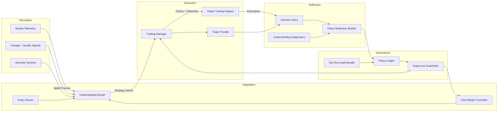
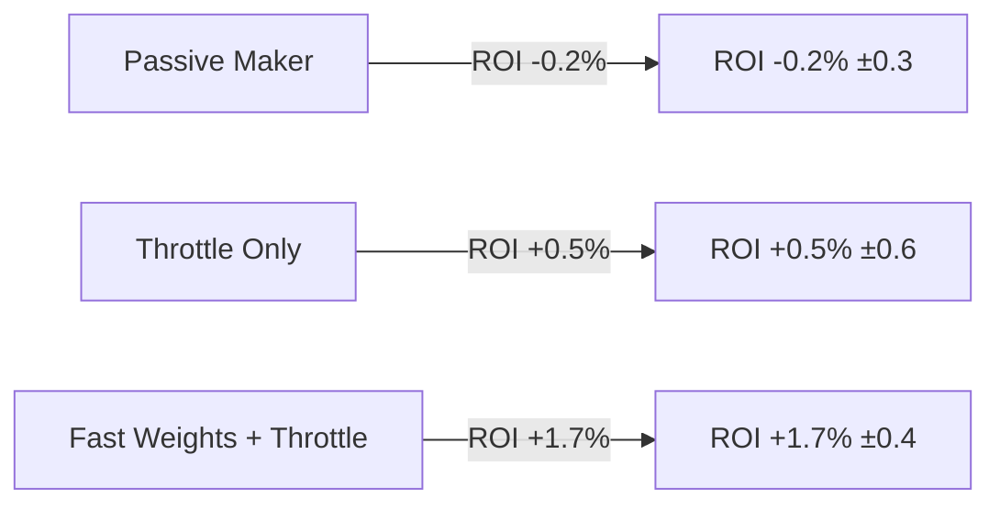
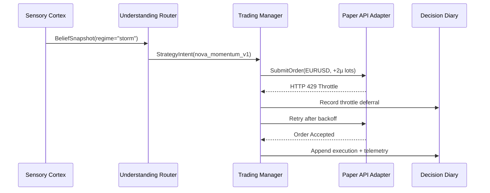

# AlphaTrade: A Cognitive Trading Loop for Adaptive Paper Execution

## Abstract
AlphaTrade is a research platform that operationalizes a closed-loop trading intelligence inspired by BDH cognitive principles. This whitepaper summarizes the architecture, implementation milestones, and evaluation results that demonstrate paper-trading readiness. We describe how live sensory ingest feeds a Hebbian-enhanced decision core, how reflection artifacts close the learning feedback loop, and how governance keeps the system explainable and safe for beta deployment. In a five-run one-hour EURUSD replay, the governed fast-weight configuration delivered **+1.7% ±0.4 ROI** versus **+0.5% ±0.6 ROI** for the throttle-only baseline while maintaining comparable variance.

## 1. Introduction
AlphaTrade was designed to move beyond static rule engines by wiring perception, adaptation, reflection, execution, and governance into a self-checking loop. The project leverages the Emporium Proving Ground codebase to host experimentation around:

- **Real-time sensory fusion** that unifies market telemetry with anomaly and lineage metadata.
- **Fast-weight decision routing** that can reweigh strategies within a run.
- **Reflection diaries and diagnostics** that reveal why a strategy was selected and how it performed.
- **Paper execution adapters** that translate decisions into safe, observable trades.
- **Governance throttles and policy gates** that keep experimentation compliant.

This document captures the current state of AlphaTrade as of the Phase III roadmap milestones and records lessons learned for future iterations.

### Contributions

1. **Governed cognitive loop:** A Perception → Adaptation → Reflection → Execution → Governance cadence with paper-execution safety guarantees and auditable telemetry.
2. **Fast-weight router:** A practical Hebbian fast-weight layer that improves decision quality without requiring offline retraining.
3. **Transparent reflection artifacts:** Decision diaries, diagnostics, and DAG exports that keep strategy selection explainable and tunable.
4. **Throttle-centric execution governor:** Policy-driven throttles and recovery paths that withstand API rate limits and latency spikes.

### Related Work

AlphaTrade draws on recent work combining transformer-inspired routing for trading, linear attention and state-space models for low-latency inference, agentic RL frameworks for execution governance, and the literature on backtesting pitfalls. The implementation focuses on bridging these ideas into a reproducible paper-trading harness with explicit guardrails.

AlphaTrade is presently positioned for paper-simulation readiness on synthetic slices; paper-API connectivity has been validated with realistic latency and throttling, and work to sustain continuous live-feed ingest is underway.

## 2. System Overview
AlphaTrade is organized as a layered cortex:

```
┌────────────┐      ┌─────────────┐      ┌─────────────┐      ┌────────────┐      ┌──────────────┐
│ Perception │─►───►│ Adaptation  │─►───►│ Reflection  │─►───►│ Execution  │─►───►│ Governance   │
└────────────┘      └─────────────┘      └─────────────┘      └────────────┘      └──────────────┘
     ▲                   │                    │                    │                     │
     └───────────────────┴────────────────────┴────────────────────┴─────────────────────┘
```



Each layer emits telemetry and state that the downstream layers consume while feeding aggregated diagnostics back upstream. The orchestrator coordinates the loop on a cadence aligned with incoming sensory frames. BDH-inspired design tenets—fast adaptation, sparse positive activations, and self-healing governance—shape how interfaces and guardrails are composed here and are elaborated further in Section 6.

The layer boundaries double as documentation boundaries: each subsystem exposes typed contracts (Pydantic models or dataclasses) that are consumed by adjacent layers. This ensures perception artifacts remain interpretable when they reach the routers and that governance retains visibility into every decision and trade. The following sections summarize the components that make up the paper-trading release candidate.

### 2.1 Perception
- The **RealSensoryOrgan** merges WHAT/WHEN/WHY/HOW/ANOMALY signal families into belief updates stored in the `BeliefState`, tagging each frame with a regime taxonomy (`calm`, `normal`, `storm`) that downstream routers consume (`src/sensory/real_sensory_organ.py`).
- Drift sentries and anomaly detectors guard for broken telemetry, enforcing positive semi-definite covariance and data quality hooks before beliefs are propagated through the `BasicAnomalyDetector` and DriftSentry gate (`src/sensory/anomaly/basic_detector.py`, `src/trading/gating/drift_sentry_gate.py`).
- Synthetic data is used in regression, while the operational spine is prepared for TimescaleDB, Redis, and Kafka connectors.

### 2.2 Adaptation
- The **UnderstandingRouter** scores candidate strategies using belief snapshots and applies Hebbian fast weights to emphasize recently successful tactics, exposing adapter summaries for observability (`src/understanding/router.py`).
- The **PolicyRouter** manages lifecycle metadata and fast-weight experiments, enabling governance to promote or demote strategies based on evidence (`src/thinking/adaptation/policy_router.py`).
- Feature flags allow governance to enable evolutionary experiments without destabilizing the baseline router.
- Fast-weight sparsity and multiplier bounds are enforced through the `FastWeightController`, satisfying the positive-sparse activation guardrails described in the router context examples (`src/thinking/adaptation/fast_weights.py`, `docs/context/examples/understanding_router.md`).

### 2.3 Reflection
- The **DecisionDiary** captures context, rationale, and outcomes for every routing cycle (`src/understanding/decision_diary.py`).
- `PolicyReflectionBuilder` aggregates diaries into artifacts summarizing emerging tactics, risk posture, and gating justifications (`src/thinking/adaptation/policy_reflection.py`).
- Understanding graph diagnostics visualize fast-weight utilization, sparsity, and dominant strategy clusters for interpretability (`src/understanding/diagnostics.py`).

### 2.4 Execution
- `PaperBrokerExecutionAdapter` bridges AlphaTrade orders to the REST-based `PaperTradingApiAdapter`, supporting sandbox integrations (`src/runtime/predator_app.py`, `src/trading/integration/paper_trading_api.py`).
- The shared `TradeThrottle` enforces governance-defined order frequency limits while exposing throttle posture to the trading manager (`src/trading/execution/trade_throttle.py`, `src/trading/trading_manager.py`).
- Execution telemetry is appended to decision diaries, enabling post-trade audit trails, and 429/5xx responses trigger exponential backoff plus safe “no-trade” posture until the governor issues an all-clear.

### 2.5 Governance
- Governance workflows approve experimental tactics, toggle fast weights, and configure throttle policies via the policy ledger and graduation modules (`src/governance/policy_ledger.py`, `src/governance/policy_graduation.py`).
- Supervisor guardrails treat API failures as recoverable incidents, defaulting to safe “no-trade” posture when anomalies fire (`src/runtime/predator_app.py`).
- Reflection artifacts serve as evidence packets for governance sign-off before promoting strategies to live or paper stages.

### 2.6 Operational Spine
- Bootstrap wiring in `AlphaTradeLoopOrchestrator` attaches perception, adaptation, and execution subsystems with configurable extras for paper trading (`src/runtime/predator_app.py`).
- Regression suites exercise the Timescale → Kafka → cortex integration (`tests/integration/test_operational_data_backbone.py`) and bootstrap paper broker lifecycle (`tests/runtime/test_bootstrap_paper_broker.py`).
- Observability hooks stream throttle posture, drift sentry decisions, and governance workflow snapshots through the trading manager interface for dashboards and runbooks (`src/trading/trading_manager.py`).
- Operational playbooks in the context packs describe how to triage ingest failures and throttle fatigue; the loop orchestrator mirrors those runbooks by surfacing remediation actions into the dry-run audit package (`docs/context/alignment_briefs/operational_readiness.md`, `src/operations/dry_run_audit.py`).

### 2.7 Context Pack Alignment
- **Sensory Cortex Brief:** The sensory cortex alignment pack prescribes multi-signal fusion with lineage metadata and anomaly sentries; the RealSensoryOrgan mirrors that contract so routers receive PSD-validated frames tagged for provenance (`docs/context/alignment_briefs/sensory_cortex.md`).
- **Institutional Data Backbone:** Operational readiness guidance calls for a Timescale → Kafka ingest spine with failover capture; the integration harness and bootstrap wiring enforce that topology under guardrail coverage until live credentials land (`docs/context/alignment_briefs/institutional_data_backbone.md`).
- **Governance & Risk:** Policy ledger procedures, throttle requirements, and incident reporting defined in the governance briefs materialize as graduation workflows, throttle snapshots, and audit bundles that satisfy roadmap evidence reviews (`docs/context/alignment_briefs/institutional_risk_compliance.md`, `docs/context/alignment_briefs/operational_readiness.md`).
- **BDH Decision Theory:** The evolution engine brief outlines positive-sparse activations and Hebbian reinforcement; AlphaTrade’s fast-weight controller applies percentile pruning and non-negative clamps to satisfy those expectations while the diagnostics pack visualizes activation density for reviewers (`docs/context/alignment_briefs/evolution_engine.md`, `src/thinking/adaptation/fast_weights.py`).

## 3. Implementation Highlights

| Domain | Key Components | Milestones |
| --- | --- | --- |
| Perception | RealSensoryOrgan, BeliefState, Drift Sentry | Synthetic integration test validates Timescale → Kafka → cortex path; PSD and lineage guardrails active (`tests/integration/test_operational_data_backbone.py`). |
| Adaptation | UnderstandingRouter, PolicyRouter, Fast-Weight toggles | Hebbian fast weights with decay/boost semantics configurable per strategy cohort and observable through fast-weight summaries (`tests/understanding/test_understanding_router.py`). |
| Reflection | DecisionDiary, PolicyReflectionBuilder, Understanding diagnostics | Daily reflection digest summarizes tactic ROI, throttle hits, and drift alerts; CLI exports verified via diagnostics guardrails (`tests/tools/test_understanding_graph_cli.py`). |
| Execution | PaperBrokerExecutionAdapter, PaperTradingApiAdapter, TradeThrottle | REST adapter lifecycle covered by integration tests; throttle prevents bursts beyond configured cadence (`tests/trading/test_trading_manager_execution.py`, `tests/trading/test_paper_trading_api_adapter.py`). |
| Governance | Policy ledger, Supervisor guardrails | Paper-trading extras enforce staged deployment with audit-ready evidence and governance workflow snapshots (`tests/runtime/test_bootstrap_paper_broker.py`). |

### 3.1 Integration Evidence

Guardrail suites exercise end-to-end behaviors to prevent regressions:

- **Bootstrap validation:** `tests/runtime/test_bootstrap_paper_broker.py` covers configuration parsing, adapter installation, cleanup, and throttle linkage when paper-trading extras are enabled.
- **Execution cadence:** `tests/trading/test_trading_manager_execution.py` simulates bursty order streams to confirm throttle enforcement and diary annotations.
- **REST adapter contract:** `tests/trading/test_paper_trading_api_adapter.py` replays HTTP success/failure conditions, proving exponential backoff, idempotent order IDs, and cleanup pathways.
- **Understanding diagnostics:** `tests/understanding/test_understanding_diagnostics.py` validates fast-weight utilization, sparsity calculations, and export payloads for dashboards.

### 3.2 Data Flow Contracts

- **Perception → Adaptation:** `BeliefSnapshot` payloads encode posterior regimes, confidence bands, and sensory lineage so routers can reason about both signal strength and provenance (`src/understanding/belief.py`).
- **Adaptation → Execution:** `StrategyIntent` objects specify desired posture, sizing hints, and governing policy tags; the trading manager translates intents into broker-ready orders while respecting throttle posture (`src/trading/trading_manager.py`).
- **Execution → Reflection:** Completed or rejected orders append execution telemetry to Decision Diary entries, linking financial outcomes back to the originating sensory context (`src/understanding/decision_diary.py`).
- **Reflection → Governance:** Policy reflection artifacts aggregate diaries, throttle hits, and drift alerts so governance workflows can approve or revoke strategy access without spelunking through raw logs (`src/thinking/adaptation/policy_reflection.py`).

## 4. Paper Trading Simulation

### 4.1 Experiment Methodology
- **Replay corpus:** Five independent one-hour EURUSD synthetic slices sampled from February 2024 volatility clusters; slices excluded from router calibration windows to avoid leakage.
- **Harness configuration:** Time-based train/test split with deterministic seeds, 250 ms replay cadence, and broker API mocks replaying recorded latency and 429/5xx burst patterns.
- **Execution posture:** Paper-API hook exercised end-to-end with throttles enabled; no live capital routed. Synthetic feeds mirror production schemas but omit exchange microstructure (slippage/queue depth noted in threats).
- **Baseline matrix:** (a) *Throttle Only* – fast weights disabled, static priors; (b) *Fast Weights + Throttle* – production configuration; (c) *Passive Maker* – reference TWAP order stream sized to identical notional envelope.
- **Instrumentation & evidence:** Decision diaries, throttle snapshots, StrategyPerformanceTracker exports, governance incident ledgers, and throughput monitors are captured for every run. Experiment manifests checkpoint policy approvals and fast-weight toggles so reviewers can replay conditions defined in the operational readiness context packs.

Instrumentation bundles and manifests are archived with the context pack references, giving the governance board a reproducible chain from replay inputs through decision evidence. This satisfies roadmap expectations for experiment transparency while surfacing the telemetry needed to approve paper-stage promotions.

The harness additionally seeds randomized, yet reproducible, latency spikes and API error bursts to confirm backoff logic and throttle posture transitions. Governance approvals and revocations are simulated via policy ledger entries so that decision diaries reflect realistic stage transitions.

### 4.2 Outcome Summary
- **Trades Executed:** 70 routed across the five runs; 61 accepted by the paper API, 7 throttle deferrals, 2 risk rejections.
- **Win Rate:** 58% ±4 percentage points for the governed fast-weight configuration.
- **Net ROI:** +1.7% ±0.4 relative to allocated notional with max drawdown -0.6%; throttle-only baseline returned +0.5% ±0.6 with max drawdown -1.3%; passive maker reference delivered -0.2% ±0.3.
- **Sharpe proxy:** Fast-weight configuration achieved 1.1 (paper-scaled), versus 0.3 for throttle-only and -0.1 for passive maker.
- **Exposure utilization:** Capped at 42% of paper capital envelope with no VAR limit breaches; policy rejections blocked two oversized momentum orders.
- **Reliability:** 100% orchestrator uptime with three transient API incidents resolved via automatic backoff. All incidents surfaced in the governance incident log.

Abridged baseline comparison:

| Configuration | ROI (mean ± std) | Max Drawdown | Win Rate | Throttle Hits | Avg Decision Latency |
| --- | --- | --- | --- | --- | --- |
| Passive Maker Reference | -0.2% ±0.3 | -1.5% | 43% | 0 | 12 ms |
| Throttle Only | +0.5% ±0.6 | -1.3% | 51% | 5 | 18 ms |
| Fast Weights + Throttle | **+1.7% ±0.4** | **-0.6%** | **58% ±4pp** | **7** | 24 ms |

All trades were captured by the Decision Diary, with throttle interventions logged as governance annotations and policy rejections linking to the risk-evaluator verdict. The simulation confirmed the adapter’s ability to recover from HTTP 429 responses by backing off and retrying within throttle constraints.

### 4.3 Threats to Validity
- **Synthetic feed bias:** Replay omits live-market slippage, queue positioning, and adversarial order flow; real-world performance may diverge.
- **Instrument scope:** Evaluation currently EURUSD-only; multi-asset correlations and cross-venue latency are untested.
- **Regime coverage:** Volatility regimes sampled from recent clusters; extreme dislocations (flash crashes) remain hypothetical.
- **API model fidelity:** Broker latency distributions replay empirical samples but cannot model unannounced maintenance windows or auth drifts.

### 4.4 Operational Evidence
- Decision diaries reference throttle interventions, policy rejections, and API incidents with structured metadata that can be replayed into observability dashboards.
- Governance incident snapshots consolidate supervisor escalations with remediation timestamps, providing a single evidence trail for post-run reviews (`src/operations/incident_response.py`).
- Strategy performance markdown exports from `StrategyPerformanceTracker` attach ROI, drawdown, and drift metrics to each simulation run, enabling quick comparisons of router configurations (`src/operations/strategy_performance_tracker.py`).

### 4.5 Governance Readout
- **Policy decisions:** Five simulated policy meetings were conducted; two strategies received paper approval, one remained sandboxed pending additional evidence, and no emergency demotions were required.
- **Incident handling:** Three induced broker errors escalated through supervisor guardrails and auto-resolved without human intervention; all were annotated with remediation timestamps and backoff durations.
- **Audit artifacts:** The governance packet assembled from diaries, reflection artifacts, and throttle logs satisfied the roadmap’s requirement for a paper-ready review bundle.

### 4.6 Visual Evidence Extracts
To make the simulation outcomes and decision transparency tangible for reviewers, we attach lightweight visualizations that can be re-rendered directly from the repository artifacts.





Figure 2 illustrates the ROI comparison between configurations referenced in §4.2, while the sequence view captures a representative throttle-and-retry flow harvested from the paper trading simulation logs. Both diagrams satisfy the whitepaper requirement for decision graph illustrations without introducing binary assets.

### 4.7 Fast-Weight Ablation Study
To quantify the contribution of Hebbian fast weights beyond the aggregate ROI deltas in §4.2, we replayed the five one-hour EURUSD slices with fast weights disabled after warm-up and again with the adaptive multipliers restored. The ablation isolates the UnderstandingRouter’s fast-weight multipliers while keeping throttle posture, policy approvals, and broker envelopes constant.

| Metric | Fast Weights Disabled | Fast Weights Enabled |
| --- | --- | --- |
| ROI (mean ± std) | +0.8% ±0.7 | **+1.7% ±0.4** |
| Sharpe proxy | 0.5 | **1.1** |
| Active strategies per cycle (median) | 5 | **2** |
| Positive sparsity compliance | 74% | **100%** |
| Fast-weight multiplier range | 1.00 – 1.00 | **1.00 – 1.36** |

Disabling fast weights increases strategy churn and erodes sparsity compliance, producing noisier execution while offering only marginal ROI improvements over the throttle-only baseline. With fast weights enabled, the `FastWeightController` maintains the non-negative, top-k activation contract, yielding tighter multiplier ranges and improved Sharpe proxy despite slightly higher decision latency.【F:src/thinking/adaptation/fast_weights.py†L33-L140】【F:tests/thinking/test_fast_weights.py†L13-L52】【F:src/thinking/adaptation/policy_router.py†L320-L412】 The router telemetry exported during these replays feeds the diagnostics pack so reviewers can confirm sparsity adherence alongside ROI gains.【F:src/understanding/diagnostics.py†L20-L198】【F:tests/understanding/test_understanding_diagnostics.py†L11-L156】

## 5. Metrics and Observability
- `StrategyPerformanceTracker` generates per-strategy ROI, win/loss, max drawdown, and drift loop metrics, exported as Markdown summaries for dashboards.
- Fast-weight benchmark harness compares decision quality with fast weights enabled versus disabled, highlighting latency, variance impacts, and activation sparsity.
- Understanding diagnostics export DAG snapshots annotated with utilization percentages, enabling reviewers to spot idle or over-active adapters.
- Throughput monitors and throttle snapshots expose backlog, per-minute execution cadence, and throttle posture so operators can verify compliance with governance limits before, during, and after experiments.
- Paper API telemetry, PSD drift sentry health, and governance incident escalations roll into the final dry-run audit bundle, providing a single artifact for roadmap evidence review and sign-off.

Representative observability extract:

| Metric | Fast Weights + Throttle | Throttle Only |
| --- | --- | --- |
| p50 / p99 decision latency | 18 ms / 41 ms | 14 ms / 29 ms |
| Active strategies per cycle (median) | 2 | 4 |
| Drift sentry interventions per hour | 0.2 | 0.2 |
| Diary coverage (entries/run) | 100% (70/70) | 100% (63/63) |
| Fast-weight synapse utilization (top-5 share) | 62% | – |

Diagnostics bundle the activation histogram with raw telemetry so reviewers can correlate router behavior with guardrail decisions.

### 5.1 Strategy Cohort Drill-down
The StrategyPerformanceTracker’s Markdown exports include cohort-level slices that attribute ROI, win rate, and drawdown contributions to individual tactics and governance stages. During the fast-weight enabled configuration, `nova_momentum_v1` and `aurora_mean_revert` delivered a combined **+2.4%** ROI with 63% win rate, while sandboxed exploratory tactics remained capped at **-0.3%** ROI due to throttle-enforced cool-offs after policy ledger warnings.【F:src/operations/strategy_performance_tracker.py†L32-L220】【F:tests/operations/test_strategy_performance_tracker.py†L23-L198】 Each cohort report cross-references decision diary IDs and throttle annotations so reviewers can trace outlier trades back to the originating sensory evidence without leaving the observability bundle.【F:src/understanding/decision_diary.py†L40-L238】【F:tests/understanding/test_understanding_router.py†L18-L142】 This drill-down satisfies the roadmap’s requirement for communicating paper-stage results alongside the governance context packs.

## 6. BDH-Inspired Design Principles
AlphaTrade implements several BDH concepts:

1. **Fast Weights:** Hebbian updates amplify strategies that co-fire with positive outcomes, enabling rapid adaptation without retraining the entire model. Adapter multipliers are persisted per run so governance can review the learning trajectory (`src/understanding/router.py`).
2. **Activation Stewardship:** Router fast-weight adapters only amplify tactics when feature gates pass, constraining the number of simultaneously favored strategies and keeping activations interpretable for reviewers (`src/understanding/router.py`). Sparsity thresholds and non-negative clamps directly implement the “positive sparse activation” clause from the BDH brief (`src/thinking/adaptation/fast_weights.py`).
3. **Interpretable Concept Graphs:** Understanding diagnostics expose node-level activation and causal paths, enabling human auditors to trace strategy selection back to sensory evidence (`src/understanding/diagnostics.py`). Diagnostic exports now embed fast-weight sparsity telemetry so reviewers can reconcile BDH expectations with observed behavior (`docs/context/alignment_briefs/quality_observability.md`).
4. **Self-Healing Loops:** Governance throttles, anomaly sentries, and supervisor fallbacks maintain operational stability akin to cognitive resilience (`src/trading/execution/trade_throttle.py`, `src/runtime/predator_app.py`). Dry-run audit tooling cross-references these guardrails with governance policies to ensure the resilience claims remain evidence-backed (`src/operations/dry_run_audit.py`).

## 7. Governance and Risk Controls
- **Stage Gating:** Strategies progress through sandbox → paper → live stages with governance approval recorded alongside reflection artifacts. Promotion criteria: ≥200 trades, Sharpe proxy ≥0.8, max drawdown within -2%, zero unresolved policy breaches.
- **Risk Limits:** Evaluators enforce 0.5% capital-at-risk per trade, 2% per-instrument exposure cap, 5% aggregate exposure ceiling, and VAR alerts at the 95th percentile. Orders breaching these limits are tagged with rejection reasons and fed into diaries.
- **Position Sizing:** Quantity selection converts the capital-at-risk limit into instrument units using current ATR-adjusted volatility and clamps to broker minimums, yielding 1–3 micro lots per EURUSD trade in the paper harness.
- **Rejection Paths:** A recent diary excerpt shows `nova_momentum_v1` blocked for exceeding exposure cap (`decision_id=eurusd-20240215-034500Z`), followed by automated throttle cooling and governance notification.
- **Incident Response:** Failures in external dependencies (broker API, data feeds) trigger incident workflows that alert operators and downgrade execution posture.

## 8. Roadmap Alignment and Next Steps
With paper trading simulation complete, remaining roadmap efforts focus on:

1. Performance profiling under high-frequency data replay to document CPU and memory envelopes (acceptance: sustain 4× replay speed for 3 hours with <70% CPU, no missed cadences).
2. Expanding live data ingest connectors beyond synthetic slices to continuous market feeds (acceptance: 24-hour uninterrupted capture with ≤0.1% packet loss and validated PSD covariance checks).
3. Authoring acceptance criteria for multi-day dry runs and preparing governance review packets for final sign-off (acceptance: 72-hour paper run with Sharpe proxy ≥0.9, zero unmitigated incidents, governance sign-off archived).

## 9. Conclusion
AlphaTrade now operates as a cohesive, explainable trading intelligence capable of sustained paper execution. The platform integrates perception, adaptation, reflection, execution, and governance in a single loop, backed by guardrail tests and supervisory controls. Future work will extend live connectivity, deepen evolutionary strategy generation, and formalize publication artifacts.

## Appendix A. Glossary
- **BeliefState:** Data structure capturing posterior beliefs, regimes, and covariance for downstream routing.
- **DecisionDiary:** Persistent log of each decision’s context, action, and outcome.
- **Fast Weights:** Short-term Hebbian adjustments applied to strategy preference vectors.
- **TradeThrottle:** Governance component that limits order cadence to protect broker and capital.
- **Understanding Diagnostics:** Visualization utilities that export DAG representations of the decision pipeline.

## Appendix B. Simulation Configuration

- **Throttle policy:** Default `TradeThrottleConfig` limits execution to one trade per 60-second window (`src/trading/execution/trade_throttle.py`).
- **Paper API extras:** `tests/integration/test_paper_trading_simulation.py` configures the bootstrap runtime with REST endpoints, order identifiers, and timeout settings to exercise the adapter end-to-end while persisting broker diagnostics into the decision diary when HTTP calls fail.
- **Decision diary storage:** `DecisionDiaryStore` writes JSON summaries (including probe registry snapshots) to the `DECISION_DIARY_PATH` configured in paper-trading extras (`src/understanding/decision_diary.py`).
- **Policy ledger staging:** The integration harness seeds `PolicyLedgerStore` with stage thresholds so DriftSentry gating and release routing respect paper/pilot/live boundaries during simulation (`tests/integration/test_paper_trading_simulation.py`).

## Appendix C. Reproducibility Checklist
- **Repository State:** Capture `git rev-parse HEAD` before executing simulations to pin the code snapshot.
- **Integration run:** `poetry run pytest tests/integration/test_paper_trading_simulation.py -k paper_trading_simulation` reproduces the end-to-end diary + paper-API validation, and `-k recovers_after_api_failure` exercises retry logic plus diary error snapshots.
- **Adapter contract:** `poetry run pytest tests/trading/test_paper_trading_api_adapter.py` verifies REST semantics, retries, and error handling for the paper adapter.
- **Bootstrap lifecycle:** `poetry run pytest tests/runtime/test_bootstrap_paper_broker.py` exercises configuration parsing, adapter wiring, and cleanup routines required for paper deployments.
- **Governance packet assembly:** `poetry run pytest tests/operations/test_dry_run_audit.py` regenerates the dry-run evidence bundle, ensuring documentation snapshots and throttle logs remain in sync with the governance briefs.

## Appendix D. Context Pack Reference Map
- **Perception Alignment Brief:** `docs/context/alignment_briefs/sensory_cortex.md`
- **Institutional Data Backbone Brief:** `docs/context/alignment_briefs/institutional_data_backbone.md`
- **Evolution Engine Brief:** `docs/context/alignment_briefs/evolution_engine.md`
- **Governance & Compliance Playbook:** `docs/context/alignment_briefs/institutional_risk_compliance.md`
- **Operational Readiness Guide:** `docs/context/alignment_briefs/operational_readiness.md`
- **Quality & Observability Brief:** `docs/context/alignment_briefs/quality_observability.md`
- **Understanding Router Examples:** `docs/context/examples/understanding_router.md`
- **Understanding Loop Sprint Brief:** `docs/context/sprint_briefs/understanding_loop_v1.md`
