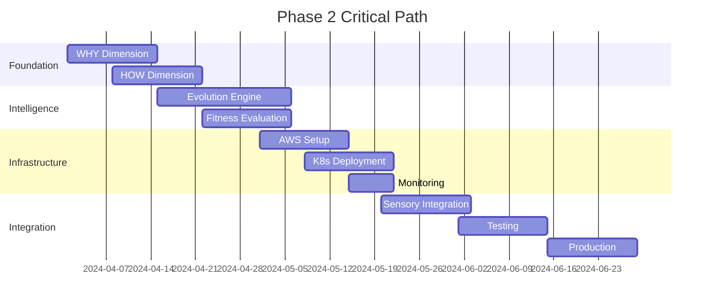

# Phase 2 Implementation Analysis: Production Hardening & Intelligence Foundation

## Overview
Phase 2 transforms the EMP from a functional foundation to a formidable production-ready system with advanced intelligence capabilities. This analysis provides strategic insights into component complexity, timeline dependencies, and success criteria.

---

## Key Components Analysis

### 1. Enhanced Sensory Cortex Implementation (5D+1)

#### Complexity Level: CRITICAL
**Timeline**: Months 4-5  
**Dependencies**: Phase 1 foundation, external data sources

#### Core Dimensions Analysis

| Dimension | Complexity | Key Features | Risk Factors |
|-----------|------------|--------------|--------------|
| **WHY** - Macro Predator | HIGH | Central bank parsing, geopolitical analysis | Data source reliability, API limits |
| **HOW** - Institutional Footprint | VERY HIGH | ICT patterns, order blocks, FVGs | Pattern validation, false positives |
| **WHAT** - Pattern Synthesis | HIGH | Fractal recognition, harmonic analysis | Computational intensity |
| **WHEN** - Temporal Advantage | MEDIUM | Session analysis, microstructure timing | Market regime changes |
| **ANOMALY** - Manipulation Detection | VERY HIGH | Spoofing, wash trading detection | Regulatory compliance |
| **CHAOS** - Antifragile Adaptation | HIGH | Black swan handling, volatility harvesting | Model overfitting |

#### Technical Challenges
1. **Data Integration Complexity**
   - Multiple external data sources (RSS feeds, APIs, news)
   - Real-time processing requirements
   - Data quality validation
   - Rate limiting and API quotas

2. **Real-time Processing**
   - Sub-second response requirements
   - High-frequency data ingestion
   - Concurrent processing across dimensions
   - Memory management for large datasets

3. **Scalability**
   - 24/7 production operations
   - Horizontal scaling requirements
   - Load balancing across dimensions
   - Resource optimization

### 2. Evolutionary Intelligence Engine

#### Complexity Level: CRITICAL
**Timeline**: Months 4-6  
**Dependencies**: Phase 1 evolution engine, advanced algorithms

#### Multi-Dimensional Fitness Evaluation

| Dimension | Weight | Metrics | Validation Method |
|-----------|--------|---------|-------------------|
| **Survival** | 30% | Max drawdown, VaR | Historical stress tests |
| **Profit** | 25% | Sharpe ratio, total return | Walk-forward analysis |
| **Adaptability** | 25% | Regime transitions | Monte Carlo scenarios |
| **Robustness** | 20% | Stress test performance | Adversarial testing |

#### Advanced Features
- **Adversarial Selection**: Stress testing with 4 core scenarios
- **Intelligent Variation**: Context-aware mutation rates
- **Epigenetic Mechanisms**: Market condition memory
- **Meta-Evolution**: Self-improving evolution parameters

#### Performance Targets
- Population size: 100-500 genomes
- Generation time: < 5 minutes
- Fitness improvement: > 5% per generation
- Memory usage: < 8GB per generation

### 3. Production Infrastructure

#### Complexity Level: HIGH
**Timeline**: Months 4-6  
**Dependencies**: Kubernetes, cloud infrastructure

#### AWS Infrastructure Components

| Component | Service | Configuration | Cost Estimate |
|-----------|---------|---------------|---------------|
| **Compute** | EKS + EC2 | 3-10 m5.large nodes | $200-800/month |
| **Database** | RDS PostgreSQL | db.t3.large, Multi-AZ | $150-300/month |
| **Cache** | ElastiCache Redis | cache.t3.micro cluster | $50-100/month |
| **Storage** | EBS + S3 | 100GB GP3 + S3 | $20-50/month |
| **Monitoring** | CloudWatch + Prometheus | Standard tier | $50-100/month |
| **Load Balancer** | ALB | Standard ALB | $20-40/month |

#### Security Architecture
- **Network Security**: VPC isolation, security groups
- **Data Security**: Encryption at rest and in transit
- **Access Control**: IAM roles, RBAC, OAuth2/JWT
- **Monitoring**: Security scanning, audit logging

### 4. Adaptive Risk Management

#### Complexity Level: CRITICAL
**Timeline**: Months 4-6  
**Dependencies**: Real-time data feeds, regulatory frameworks

#### Multi-Regime Risk Models

| Regime Type | Detection Method | Position Adjustment | Example |
|-------------|------------------|---------------------|---------|
| **Low Volatility** | VIX < 15 | Increase size 20% | Normal markets |
| **High Volatility** | VIX > 30 | Decrease size 40% | Crisis periods |
| **Trending** | ADX > 25 | Trend-following bias | Strong trends |
| **Ranging** | ADX < 20 | Mean-reversion bias | Sideways markets |

#### Real-Time Correlation Monitoring
- **Rolling Windows**: 5, 20, 60-day correlations
- **Sector Monitoring**: Industry group correlations
- **Cross-Asset**: Equity, bond, commodity correlations
- **Concentration Limits**: Maximum single position 5%

---

## Implementation Challenges

### Technical Challenges

#### 1. Data Integration Complexity
**Problem**: Multiple external data sources with different formats and reliability
**Solution**: 
- Implement robust data validation pipelines
- Use circuit breakers for unreliable sources
- Maintain fallback data sources
- Implement data quality scoring

#### 2. Real-time Processing
**Problem**: Sub-second response requirements with complex calculations
**Solution**:
- Implement async/await patterns
- Use Redis for caching intermediate results
- Optimize algorithms for vectorized operations
- Implement connection pooling

#### 3. Scalability
**Problem**: 24/7 production operations with varying load
**Solution**:
- Horizontal pod autoscaling based on CPU/memory
- Database read replicas for query load
- Redis cluster for distributed state
- CDN for static assets

### Architectural Challenges

#### 1. Component Integration
**Problem**: 5D+1 sensory coordination and data consistency
**Solution**:
- Event-driven architecture with NATS streaming
- Unified data models across dimensions
- Consistent timestamp handling
- Cross-validation between dimensions

#### 2. Performance Optimization
**Problem**: High-frequency processing with limited resources
**Solution**:
- Profile-guided optimization
- Memory-mapped file access
- GPU acceleration for pattern recognition
- Incremental computation strategies

#### 3. Fault Tolerance
**Problem**: Zero-downtime requirements
**Solution**:
- Blue-green deployment strategy
- Health checks and automatic recovery
- Circuit breakers for external services
- Graceful degradation strategies

#### 4. Monitoring Complexity
**Problem**: Multi-dimensional observability
**Solution**:
- Structured logging with correlation IDs
- Distributed tracing with Jaeger
- Custom metrics for business KPIs
- Real-time alerting with PagerDuty

---

## Success Criteria Analysis

### Technical Milestones Verification

#### 1. Complete 5D+1 Sensory Cortex Operational
**Verification Method**: Integration testing suite
**Success Metrics**:
- All 6 dimensions return valid readings
- Cross-dimensional correlation > 0.7
- Response time < 5 seconds for complete analysis
- Confidence scores > 0.8 for major events

#### 2. Advanced Evolution Engine Producing Better Strategies
**Verification Method**: A/B testing framework
**Success Metrics**:
- 30+ generations with measurable improvement
- Statistical significance p < 0.05
- Sharpe ratio improvement > 0.3
- Maximum drawdown reduction > 20%

#### 3. Production Infrastructure Handling 24/7 Operations
**Verification Method**: Chaos engineering
**Success Metrics**:
- 99.9% uptime over 30 days
- Zero-downtime deployments verified
- Auto-scaling responds within 2 minutes
- Disaster recovery < 15 minutes

#### 4. Zero Critical Security Vulnerabilities
**Verification Method**: Security audit
**Success Metrics**:
- OWASP Top 10 compliance
- Penetration testing passed
- No critical CVEs in dependencies
- Security headers properly configured

#### 5. Sub-Second Response Times
**Verification Method**: Performance testing
**Success Metrics**:
- p95 response time < 500ms
- p99 response time < 1 second
- Throughput > 1000 requests/second
- Memory usage < 4GB per pod

### Performance Milestones Verification

#### 1. 30+ Days Continuous Operation
**Verification Method**: Stability monitoring
**Success Metrics**:
- No critical incidents
- Resource utilization < 80%
- Memory leaks not detected
- Performance degradation < 5%

#### 2. Measurable Strategy Improvement
**Verification Method**: Backtesting framework
**Success Metrics**:
- Fitness improvement > 5% per generation
- Out-of-sample performance maintained
- Risk-adjusted returns > 1.5 Sharpe
- Consistency across market conditions

#### 3. Risk Management Effectiveness
**Verification Method**: Stress testing
**Success Metrics**:
- Maximum drawdown < 3% in normal conditions
- Risk limits enforced automatically
- Correlation monitoring prevents >10% concentration
- Stress test scenarios passed

#### 4. Sensory System Accuracy
**Verification Method**: Historical validation
**Success Metrics**:
- Anomaly detection > 90% accuracy
- Pattern recognition > 85% precision
- False positive rate < 10%
- Event prediction > 70% accuracy

#### 5. Strategy Performance
**Verification Method**: Live trading validation
**Success Metrics**:
- Generated strategies > 1.5 Sharpe ratio
- Risk-adjusted returns exceed benchmark
- Consistent performance across market conditions
- Transaction costs < 20% of alpha

---

## Timeline and Dependency Mapping

### Critical Path Analysis

### Risk Mitigation Strategies

#### High-Risk Items
1. **Central Bank API Reliability**
   - **Risk**: API rate limits or downtime
   - **Mitigation**: Multiple data sources, caching, fallback mechanisms

2. **Pattern Recognition Accuracy**
   - **Risk**: False signals leading to poor trades
   - **Mitigation**: Extensive backtesting, confidence scoring, human validation

3. **Evolution Convergence**
   - **Risk**: Strategies don't improve over generations
   - **Mitigation**: Diverse initial population, adaptive mutation rates, multiple fitness dimensions

4. **Production Stability**
   - **Risk**: System crashes or performance degradation
   - **Mitigation**: Comprehensive testing, gradual rollout, rollback procedures

#### Medium-Risk Items
1. **Data Quality Issues**
   - **Mitigation**: Data validation pipelines, quality scoring, source redundancy

2. **Regulatory Changes**
   - **Mitigation**: Compliance monitoring, flexible architecture, legal review

3. **Market Regime Shifts**
   - **Mitigation**: Adaptive algorithms, regime detection, stress testing

---

## Resource Requirements

### Development Team
- **Lead Engineer**: 1 FTE (full-time)
- **Backend Engineers**: 2 FTE
- **DevOps Engineer**: 1 FTE
- **Data Scientist**: 1 FTE
- **QA Engineer**: 1 FTE
- **Security Specialist**: 0.5 FTE

### Infrastructure Costs (Monthly)
- **Development**: $500-1000
- **Staging**: $1000-2000
- **Production**: $2000-5000
- **Monitoring**: $200-500
- **Total**: $3700-8500

### Tooling and Services
- **AWS Services**: $2000-4000/month
- **Monitoring Tools**: $500-1000/month
- **Data Sources**: $1000-3000/month
- **Development Tools**: $500-1000/month

---

## Conclusion

Phase 2 represents a critical transformation from functional prototype to production-ready system. The complexity is high, but the systematic approach outlined in this analysis provides a clear path to success.

### Key Success Factors
1. **Systematic Implementation**: Follow the phased approach religiously
2. **Rigorous Testing**: Maintain 100% test coverage for critical components
3. **Performance Monitoring**: Real-time metrics and alerting
4. **Risk Management**: Conservative approach with extensive validation
5. **Team Coordination**: Clear communication and regular checkpoints

### Expected Outcomes
- **Technical**: Production-grade system with 99.9% uptime
- **Performance**: >1.5 Sharpe ratio strategies with <3% drawdown
- **Operational**: 24/7 autonomous operation with minimal intervention
- **Scalability**: Horizontal scaling to handle 10x growth

The investment in Phase 2 will establish EMP as a formidable, production-ready trading intelligence system capable of continuous evolution and adaptation to market conditions while maintaining enterprise-grade reliability and security.
