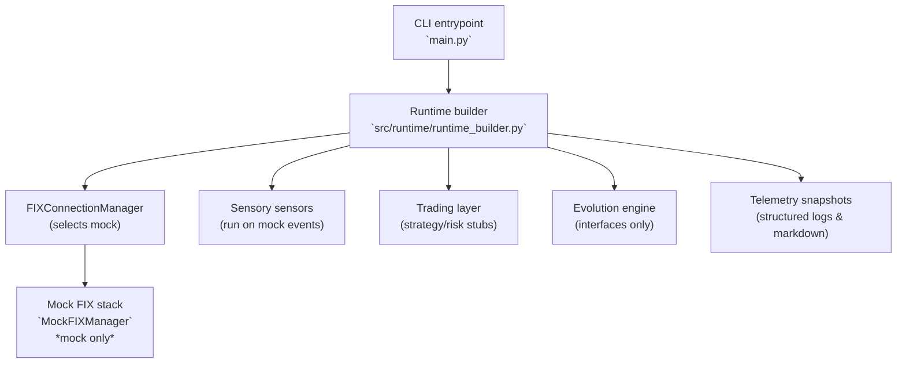

# Architecture Overview

This overview mirrors the **current** EMP Proving Ground runtime: a simulator-
backed harness that exercises the FIX plumbing while higher-level intelligence,
strategy, and risk layers remain skeletal. Anything marked as *mock* below runs
purely in-process with synthetic data.

## System Posture

- Entrypoint: `main.py` builds the runtime and always selects the mock FIX stack.
- Market data & fills: `src/operational/mock_fix.py` synthesises ticks and
  executions; there is no live venue connectivity shipped in this repository.
- Trading scaffolding: `src/trading/` provides interfaces and telemetry routing
  but delegates to logging or TODO blocks for real decision logic.
- Evolution/intelligence layers: interface definitions only, gated by feature
  flags and unimplemented execution hooks.

## Runtime Walkthrough

1. `main.py` loads configuration, initialises structured logging, and invokes
   `build_professional_predator_app`.
2. The runtime builder wires the event bus, registry scaffolding, and the
   `FIXConnectionManager`, which defaults to the mock when no live credentials
   are present (the public repository ships no credentials).
3. `MockFIXManager` generates deterministic order lifecycle events, powering the
   sensory organs and trading scaffolding for regression and exploratory runs.
4. Sensory components consume the mock events to compute diagnostics; they do
   not source external data.
5. Trading, risk, and evolution packages expose abstractions and telemetry, but
   the business logic is intentionally incomplete pending future development.

## Reality Checklist

| Component | Status |
| --- | --- |
| Data ingress | Mock FIX events only. No Timescale, Redis, Kafka, or live market feeds are wired. |
| Execution routing | Simulator orders only; live adapters are placeholders guarded by TODOs. |
| Strategy & risk | Interfaces with logging stubs; no production decisioning. |
| Evolution engine | Feature-flagged scaffolding with unimplemented workers. |
| Observability | Structured logging plus Markdown status exports for the simulator environment. |

For the canonical truth about implementation coverage, see
`docs/DEVELOPMENT_STATUS.md` and update this diagram whenever modules graduate
from mock to real integrations.
