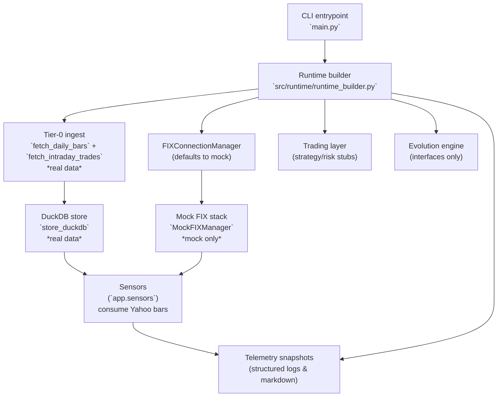

# Architecture Overview

This overview mirrors the **current** EMP Proving Ground runtime: a simulator-
backed harness for order flow paired with an optional Yahoo Finance ingest that
populates DuckDB before sensors run. Anything marked as *mock* below runs
purely in-process with synthetic data; items labelled *real* hit external
services or persist real data.

## System Posture

- Entrypoint: `main.py` builds the runtime and always selects the mock FIX stack.
- Tier-0 ingest (real): `src/runtime/runtime_builder._run_tier0_ingest` pulls
  Yahoo Finance bars via `fetch_daily_bars` / `fetch_intraday_trades` and writes
  them to DuckDB when ingest is not skipped.
- Market data & fills (mock): `src/operational/mock_fix.py` synthesises ticks
  and executions; there is no live venue connectivity shipped in this
  repository.
- Trading scaffolding (mock-aware): `src/trading/` provides interfaces and
  telemetry routing but delegates to logging or TODO blocks for real decision
  logic.
- Evolution/intelligence layers (scaffolding): interface definitions only,
  gated by feature flags and unimplemented execution hooks.

## Runtime Walkthrough

1. `main.py` loads configuration, initialises structured logging, and invokes
   `build_professional_predator_app`.
2. The runtime builder wires the event bus, registry scaffolding, optional
   Tier-0 ingest workflow, and the `FIXConnectionManager`, which defaults to the
   mock when no live credentials are present (the public repository ships no
   credentials or real manager modules).
3. When ingest runs, Yahoo Finance data is written to DuckDB via
   `store_duckdb`, then pushed through registered sensors for signal summaries.
4. `MockFIXManager` generates deterministic order lifecycle events, powering the
   sensory organs and trading scaffolding for regression and exploratory runs.
5. Trading, risk, and evolution packages expose abstractions and telemetry, but
   the business logic is intentionally incomplete pending future development.

## Reality Checklist

| Component | Status |
| --- | --- |
| Data ingress | Yahoo Finance ingest to DuckDB is real but optional; runtime streaming stays mock. No Timescale, Redis, or Kafka pipelines run. |
| Execution routing | Simulator orders only; live adapters require private modules and credentials. |
| Strategy & risk | Interfaces with logging stubs; no production decisioning. |
| Evolution engine | Feature-flagged scaffolding with unimplemented workers. |
| Observability | Structured logging plus Markdown status exports for the simulator environment. |

For the canonical truth about implementation coverage, see
`docs/DEVELOPMENT_STATUS.md` and update this diagram whenever modules graduate
from mock to real integrations.
