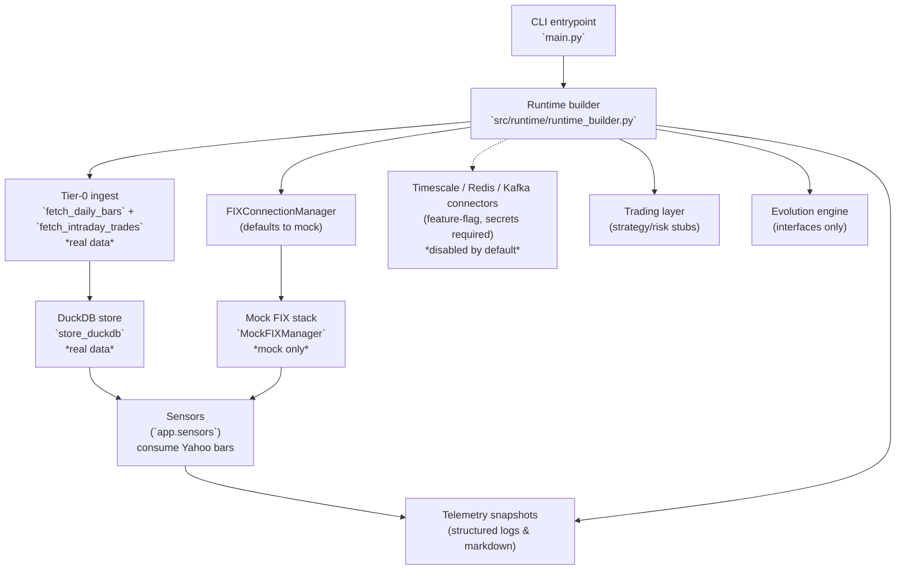

# Architecture Overview

This overview mirrors the **current** EMP Proving Ground runtime: a simulator-
backed harness for order flow paired with an optional Yahoo Finance ingest that
populates DuckDB before sensors, strategy prototypes, and risk policies run.
Anything marked as *mock* below runs purely in-process with synthetic data;
items labelled *real* hit external services or persist real data.

## System Posture

- Entrypoint: `main.py` builds the runtime and always selects the mock FIX stack.
- Tier-0 ingest (real): `src/runtime/runtime_builder._run_tier0_ingest` pulls
  Yahoo Finance bars via `fetch_daily_bars` / `fetch_intraday_trades` and writes
  them to DuckDB when ingest is not skipped.
- Market data & fills (mock): `src/operational/mock_fix.py` synthesises ticks
  and executions; there is no live venue connectivity shipped in this
  repository.
- Institutional backbone (feature-flagged): Timescale, Redis, and Kafka
  connectors ship with the repository but remain inert without injected
  secrets; default bootstrap runs fall back to the DuckDB/Yahoo Tier-0 ingest.
- Trading scaffolding (mock-aware): `src/trading/` provides interfaces and
  telemetry routing but delegates to logging or TODO blocks for real decision
  logic.
- Evolution/intelligence layers (scaffolding): interface definitions only,
  gated by feature flags and unimplemented execution hooks.

## Runtime Walkthrough

1. `main.py` loads configuration, initialises structured logging, and invokes
   `build_professional_predator_app`.
2. The runtime builder wires the event bus, registry scaffolding, optional
   Tier-0 ingest workflow, strategy registry, and default paper/mock order
   adapters. It always selects the simulator unless a downstream build supplies
   live broker bindings and credentials.
3. When ingest runs, Yahoo Finance data is written to DuckDB via
   `store_duckdb`, then pushed through registered sensors for signal summaries.
4. Strategies consume DuckDB snapshots to emit signals that are immediately
   revalidated by `RiskPolicy` + `PortfolioMonitor` before hitting the paper/mock
   adapters.
5. `LiveBrokerExecutionAdapter` remains dormant until a private broker module is
   injected; once configured it revalidates intents using the same risk policy
   pipeline before submitting to the live venue.
6. Timescale/Redis/Kafka connectors are gated behind feature flags and secrets;
   without those credentials the public build skips their activation paths.
7. `MockFIXManager` continues generating deterministic order lifecycle events
   for regression and exploratory runs, while evolution/intelligence packages
   remain interface scaffolding pending future development.

## Reality Checklist

| Component | Status |
| --- | --- |
| Data ingress | Yahoo Finance ingest to DuckDB is real but optional; runtime streaming remains mock. Institutional connectors stay disabled without secrets. |
| Strategies | Research-grade implementations produce signals from DuckDB/Yahoo data while defaulting to paper/mock execution. |
| Risk & execution | Risk policies, portfolio monitoring, and live broker adapters are implemented but depend on private broker bindings for true live submission. |
| Evolution engine | Feature-flagged scaffolding with unimplemented workers. |
| Observability | Structured logging plus Markdown status exports for ingest, simulator, and risk adapters; no live venue dashboards. |

For the canonical truth about implementation coverage, see
`docs/DEVELOPMENT_STATUS.md` and update this diagram whenever modules graduate
from mock to real integrations.
