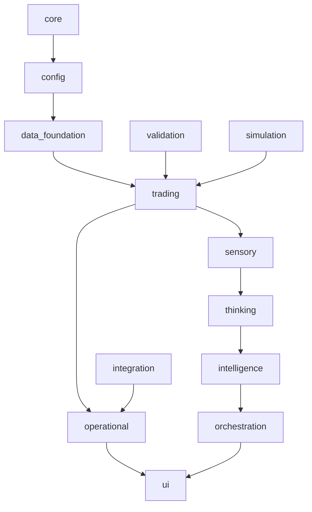

# EMP Architecture and Refactor Roadmap

Version: 0.1  
Owner: Architecture Guild  
Status: Draft for approval

## Goals
- Remove spaghetti by enforcing clear boundaries, single responsibility, and explicit contracts.
- Keep CI green at every step; no regressions in tests, lint, type checks.
- Make refactors incremental, reversible, and observable.

## Baseline and constraints
- Python 3.11 on CI; local 3.13 supported only for lightweight ops.
- Current gates: Ruff minimal set green; Mypy green via scoped excludes; coverage 70% with report include narrowed; policy checks green.
- Import hygiene already defined in [contracts/importlinter.toml](contracts/importlinter.toml:).

## Guiding principles
- Layered architecture with one direction of dependencies.
- No runtime re-exports that create hidden edges; use explicit __all__.
- No module level side effects; main entrypoints only.
- Public APIs typed; private modules can be relaxed temporarily.
- Feature toggles via configuration not imports.

## Target architecture layers
The system is organized into stable layers from bottom to top; edges only point downward.

## Allowed dependency rules
- Each package may import only from itself and lower layers.
- Cross-domain imports at same layer are forbidden except via explicit facades.
- No cycles inside packages; refactor large packages into subpackages to enforce acyclicity.

## Contracts to codify
- Layers: enforce the order in [contracts/importlinter.toml](contracts/importlinter.toml:9).
- Independence: key domains remain independent as already started in [contracts/importlinter.toml](contracts/importlinter.toml:34).
- Add per-package no-cycles by subdividing large modules (see Actions below).

## High-risk spaghetti hotspots
- Large monoliths:
  - [src/sensory/organs/dimensions/pattern_engine.py](src/sensory/organs/dimensions/pattern_engine.py:)
  - [src/operational/metrics.py](src/operational/metrics.py:)
  - [src/core/population_manager.py](src/core/population_manager.py:)
  - [src/trading/portfolio/real_portfolio_monitor.py](src/trading/portfolio/real_portfolio_monitor.py:)
- Runtime re-exports and lazy imports:
  - [src/intelligence/*.py](src/intelligence:)
  - [src/domain/__init__.py](src/domain/__init__.py:)
  - [src/performance/__init__.py](src/performance/__init__.py:)
- API mismatches and env-typed literals:
  - [src/governance/system_config.py](src/governance/system_config.py:)
- Signature divergences:
  - [src/core/event_bus.py](src/core/event_bus.py:)

## Tactics per hotspot
1) Pattern engine split  
- Extract pure feature calculators into src/sensory/what/features/*.py  
- Extract pattern definitions into src/sensory/what/patterns/*.py  
- Provide a small orchestrator with dependency injection.  
- Acceptance: file length < 400 lines per module; import-linter no cycles; tests for extracted modules.

2) Operational metrics segregation  
- Split Prometheus helpers from application counters.  
- Introduce src/operational/metrics_registry.py for registry and ensure idempotent init.  
- Acceptance: src/operational/metrics.py < 300 lines; no E402 exceptions required.

3) Population manager alignment  
- Define DecisionGenome dataclass in [src/genome/models/genome.py](src/genome/models/genome.py:) and normalize usage.  
- Remove constructor keyword mismatches; adapters at boundaries only.  
- Acceptance: mypy no overrides in core.*; contract tests green.

4) Event bus API harmonization  
- Choose canonical async publish(event) signature; adapt legacy pub(topic,payload) behind a facade.  
- Acceptance: single publish signature; mypy consistent; tests updated.

5) System config typing  
- Replace Literal env settings with Enum and safe coercion.  
- Provide get_env helper returning validated config.  
- Acceptance: mypy green without ignores in [src/governance/system_config.py](src/governance/system_config.py:).

6) Re-export cleanup  
- Replace module-level re-exports with explicit imports and __all__.  
- For real lazy load, use importlib in functions, not at module top.  
- Acceptance: remove E402 per-file ignores progressively from [pyproject.toml](pyproject.toml:20).

7) Directory unification  
- Consolidate overlap between [src/sensory](src/sensory:) and [src/market_intelligence](src/market_intelligence:).  
- Decide canonical namespace; mark the other as facades or migrate.  
- Acceptance: single canonical path referenced by app.

## Ratchet plan
### Ruff
- Phase A: enable I001 across repo and remove per-file E402 gradually.
- Phase B: enable B (bugbear) and W (pycodestyle warnings) selectively.
- Phase C: enable import conventions (I) and sorting repo-wide.

### Mypy
- Phase A: remove overrides for core, trading, data_foundation; add [types-PyYAML].
- Phase B: set disallow_untyped_defs=true in core and trading.
- Phase C: remove ignore_missing_imports gradually.

### Coverage
- Current include narrowed in [pyproject.toml](pyproject.toml:117) to pass gates.
- Phase A: add tests for src/core/event_bus.py, src/trading/models/order.py, src/operational/metrics.py.
- Phase B: widen include to entire trading and data_foundation.config.
- Phase C: remove include and rely on omit for generated or experimental code.

## Work plan and milestones
- M0: Approve this roadmap.
- M1: Contracts hardening: update [contracts/importlinter.toml](contracts/importlinter.toml:) with per-package layers; add no-cycles for split packages.
- M2: Pattern engine split and tests.
- M3: Event bus harmonization.
- M4: Metrics segregation.
- M5: Population manager alignment.
- M6: Config typing and env validation.
- M7: Coverage ratchet A and widen include.
- M8: Remove E402 ignores.
- M9: Coverage ratchet B, then remove include.

## Definition of done
- Import-linter contracts pass, no cycles.
- Ruff with extended rule set passes without per-file E402 ignores.
- Mypy with reduced overrides green in core and trading.
- Coverage ≥ 70% without narrowed include.
- No runtime re-exports or side-effect imports.

## Risks and mitigations
- Hidden coupling: instrument import-linter and run in PR.
- Performance regressions: use simulation/backtest smoke run as guard.
- API breaks: deprecate at boundaries and provide adapters.

## Rollout strategy
- Small PRs per tactic with measurable outcomes.
- Feature flags for risky substitutions.
- Back out strategy documented per PR.

## KPIs
- LCOM, cyclomatic complexity; lines per module.
- Number of import-linter violations.
- Number of per-file lint ignores.
- Coverage trend per package.

## Appendix: Commands
- Import linter: lint-imports --config [contracts/importlinter.toml](contracts/importlinter.toml:)
- Ruff full: ruff check .
- Mypy focused: mypy src
- Coverage (CI parity): pytest tests/current --cov=src --cov-config=pyproject.toml --cov-report=term