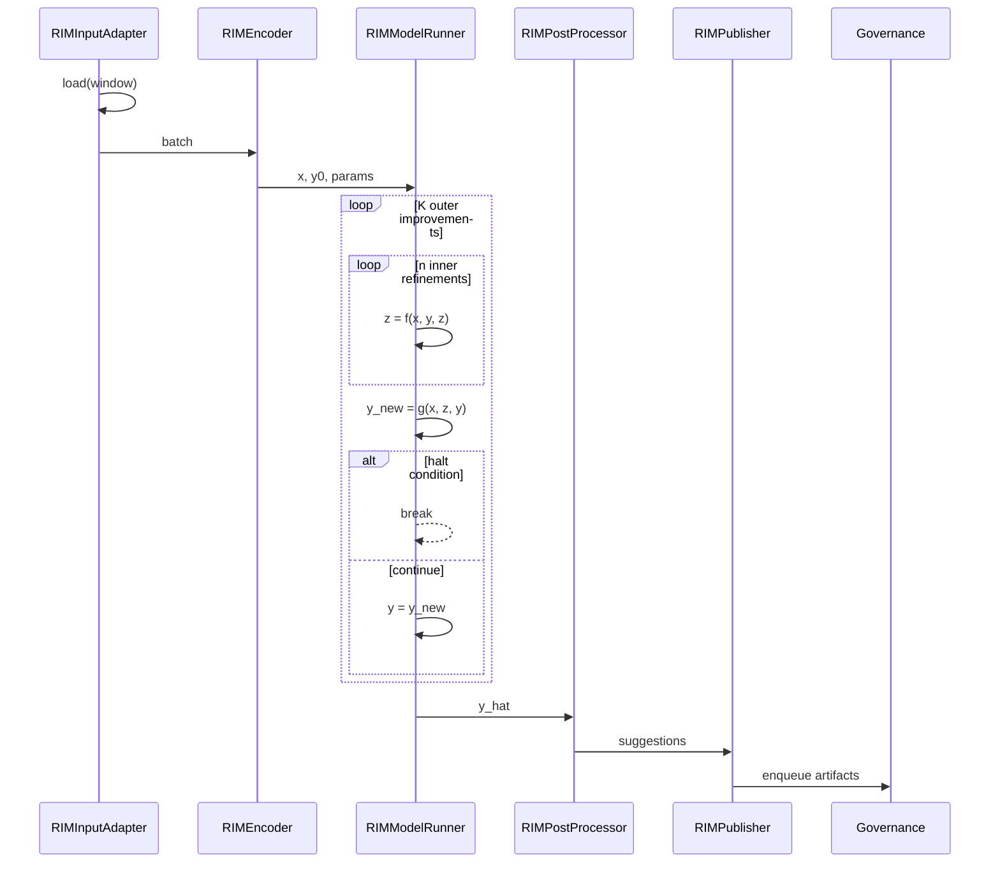

# TRM Loop Mermaid Sequence

```mermaid
sequenceDiagram
    participant Adapter as RIMInputAdapter
    participant Encoder as RIMEncoder
    participant Runner as RIMModelRunner
    participant Post as RIMPostProcessor
    participant Publisher as RIMPublisher

    Adapter->>Adapter: load(window)
    Adapter->>Encoder: batch
    Encoder->>Runner: x, y0, params
    loop K outer improvements
        loop n inner refinements
            Runner->>Runner: z = f(x, y, z)
        end
        Runner->>Runner: y_new = g(x, z, y)
        alt halt condition
            Runner-->>Runner: break
        else continue
            Runner->>Runner: y = y_new
        end
    end
    Runner->>Post: y_hat
    Post->>Publisher: suggestions
    Publisher->>Governance: enqueue artifacts
```
