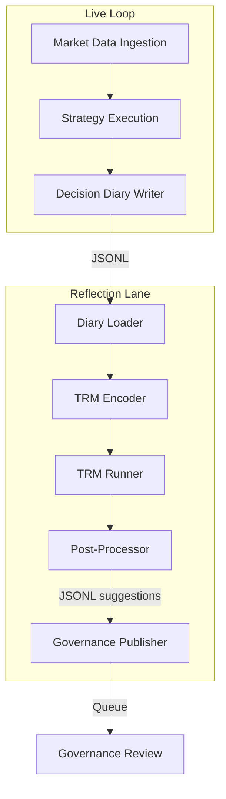
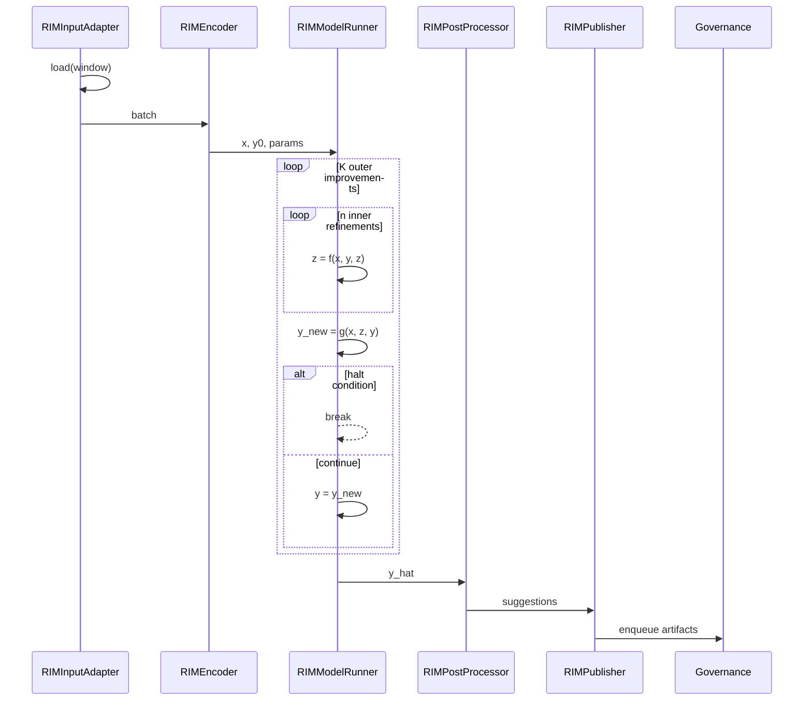

# Reflection Intelligence Module (RIM) — TRM Design

## Executive Summary

The Reflection Intelligence Module (RIM) introduces a Tiny Recursive Model (TRM) runner that asynchronously inspects Decision Diaries and produces advisory suggestions for governance review. It operates off the critical path, refining candidate insights across a lightweight recursive loop before publishing JSONL artifacts to `artifacts/rim_suggestions/`. This design outlines data contracts, interfaces, telemetry, and safety rails required for a controlled rollout without modifying live trading logic.

## System Architecture



## TRM Loop Sequence



> See [docs/design/mermaid_assets/trm_loop.md](../design/mermaid_assets/trm_loop.md) for reusable Mermaid source.

## Data Contracts

### DecisionDiaryEntry

| Field | Type | Description |
| --- | --- | --- |
| `schema_version` | string (`"rim.v1"`) | Contract version. |
| `input_hash` | string | SHA-256 hash of source diary slice. |
| `model_hash` | string | Placeholder (`"n/a"` in shadow mode). |
| `config_hash` | string | Hash of config used during write. |
| `timestamp` | string (ISO-8601, UTC) | Event time; loaders must normalize local timestamps to UTC prior to ingestion. |
| `instrument` | string | Symbol or asset identifier. |
| `strategy_id` | string | Strategy identifier. |
| `features_digest` | object | Key aggregates powering reflection. |
| `belief_state_summary` | object | Lightweight posterior/state summary. |
| `action` | string | Executed decision label. |
| `risk_flags` | array[string] | Flags raised during execution. |
| `pnl` | number | Profit/loss delta. |
| `outcome_labels` | array[string] | Post-hoc annotations (e.g., win/loss). |

### RIMInputBatch

| Field | Type | Description |
| --- | --- | --- |
| `schema_version` | string (`"rim.v1"`) | Contract version. |
| `input_hash` | string | Aggregate hash of included entries. |
| `model_hash` | string | Hash of TRM weights (shadow mode uses stub). |
| `config_hash` | string | Hash of active configuration. |
| `window` | object | `{ "start": ISO (UTC), "end": ISO (UTC), "minutes": int }`. |
| `entries` | array[DecisionDiaryEntry] | Raw diary slice. |
| `aggregates` | object | Summary stats (counts, pnl aggregates, flags). |

### RIMSuggestion

| Field | Type | Description |
| --- | --- | --- |
| `schema_version` | string (`"rim.v1"`) | Contract version. |
| `input_hash` | string | Hash of originating batch. |
| `model_hash` | string | Hash of TRM weights used. |
| `config_hash` | string | Hash of config used for inference. |
| `suggestion_id` | string | Deterministic UUID for audit. |
| `type` | enum | `WEIGHT_ADJUST \| STRATEGY_FLAG \| EXPERIMENT_PROPOSAL`. |
| `payload` | object | Type-specific recommendation body. |
| `confidence` | number [0,1] | Model confidence. |
| `rationale` | string | Human-readable explanation. |
| `audit_ids` | array[string] | Cross-links to diary entries. |
| `created_at` | string (ISO-8601, UTC) | Suggestion emission time. |

Canonical schemas live in [`interfaces/rim_types.json`](../../interfaces/rim_types.json). Diary entries within a batch are sorted by timestamp (stable on ties) before hashing to guarantee deterministic `input_hash` values.

Schema versioning follows `rim.v1` today. Readers must ignore unknown fields for backward compatibility. Any breaking contract change triggers a bump to `rim.v2` and a minimum 90-day dual-write period emitting both schema versions.

## Interfaces

```python
class RIMInputAdapter:
    def load(self, window) -> RIMInputBatch: ...

class RIMEncoder:
    def encode(self, batch) -> tuple[x, y0]: ...

class RIMModelRunner:
    def run(self, x, y0, params) -> y_hat: ...

class RIMPostProcessor:
    def to_suggestions(self, y_hat) -> list[RIMSuggestion]: ...

class RIMPublisher:
    def publish(self, suggestions: list[RIMSuggestion]) -> ArtifactRef: ...
```

## Latency Stance

RIM operates asynchronously. Runs occur at end-of-session or scheduled intervals (`window_minutes` config) and **never** block live decision loops.

## Safety Controls

- Governance approval required prior to acting on suggestions.
- `enable_governance_gate` must remain `true`; publishers only enqueue to the policy ledger queue.
- Configuration `kill_switch` halts emissions while allowing diagnostics.
- Telemetry captures runtime percentiles and suggestion counts to spot anomalies.

## Configuration Keys

Referenced in [`config/reflection/rim.config.example.yml`](../../config/reflection/rim.config.example.yml):

- `diaries_dir`, `diary_glob`
- `window_minutes`, `min_entries`, `suggestion_cap`, `confidence_floor`
- `enable_governance_gate`, `publish_channel`, `kill_switch`
- `telemetry.log_dir`
- `trm_params.K_outer`, `trm_params.n_inner`, `trm_params.halt_enabled`
- `redact.fields`, `redact.mode`

## Operational Policies

- **File locking & idempotency:** Only one RIM job may publish into `artifacts/rim_suggestions/` at a time. Writers acquire `artifacts/locks/rim.lock` and exit cleanly if the lock exists and is younger than two hours. Output filenames follow `rim-suggestions-UTC-<ISO>-<RUN_ID>.jsonl` with `RUN_ID = <yyyyMMddHHmmssZ>-<hostname>-<pid>`. Replays reuse the same `RUN_ID` for idempotency or set `rerun_of` to the original run identifier.
- **Failure handling:** Corrupt JSONL lines are skipped (counted vs `total_lines`), missing fields fall back to documented defaults (e.g., `belief_state_summary.vector = zeros(32)`), and diary entries are sorted chronologically before hashing/emission (stable on ties).
- **Privacy & redaction:** Configuration exposes a `redact` block with allowlisted fields and a `hash` or `drop` mode. Sensitive identifiers (e.g., `account_id`, `order_id`) appearing in diaries must be hashed or removed before artifact publication, and secrets/API keys are never persisted in artifacts or telemetry.
- **Retention:** Suggestion artifacts retain for 30 days via `rim_prune`. Decision Diary sources retain for 90 days (or per data platform retention policy if stricter) so ops teams understand the archival footprint.

## Determinism & Governance

- Training runs set deterministic seeds across Python, NumPy, and PyTorch, enable deterministic kernels, and record `torch.version`, CUDA build, and device info in experiment metadata.
- Inference paths avoid RNG usage; any future stochastic augmentation must be guarded by a configuration flag defaulting to disabled.
- Governance approval remains a hard gate. RIM cannot mutate live weights—only the Governance process may apply approved suggestions.

## Training Plan (Documentation Only)

1. Source supervised labels from simulation/backtest outcomes using Decision Diaries plus curated annotations.
2. Periodically retrain (monthly/quarterly) with drift checks on feature distributions and suggestion acceptance.
3. Maintain shadow datasets for ablations and fairness/robustness audits.

## Evaluation Plan

- **Precision/Recall:** Compare suggestions against governance decisions and post-hoc labels.
- **Acceptance Rate:** Track governance-approved suggestions vs. total emitted.
- **Downstream Impact:** Measure changes to Sharpe, drawdown, and win/loss rates during pilots.
- **Ablations:** Remove latent updates (`n_inner=0`) or reduce outer loops to assess TRM contribution.

## Telemetry

Monitor and log:

- Latency distributions: `p50_ms`, `p95_ms`.
- Throughput: `windows_processed`, `windows_halted_early_%`.
- Suggestion quality mix: `suggestions_emitted`, `suggestions_dropped_low_confidence`, governance acceptance percentage, and downstream impact deltas (Sharpe, drawdown).

## Risks & Mitigations

| Risk | Mitigation |
| --- | --- |
| Spurious correlations in diaries | Use simulation diversity, cross-validation, and governance reviews. |
| Regime shifts | Rolling retrains with drift detection on aggregates. |
| Over-suggestion / alert fatigue | Enforce `suggestion_cap` and `confidence_floor`; monitor acceptance. |

## Acceptance Criteria Checklist

- [ ] Shadow run emits JSONL suggestions matching `interfaces/rim_types.json`.
- [ ] Governance gate loads suggestions without errors.
- [ ] Telemetry file contains runtime + acceptance metrics.
- [ ] Markdown lint & link check pass.

## Non-regression Checklist

- [ ] No changes under `risk/` or `execution/` packages.
- [ ] No new heavy ML dependencies in requirements.

## Dependencies & Open Questions

- Confirm governance ingestion API for policy ledger queue.
- Retention enforcement job satisfied by `make rim-prune` (30-day window) and optional scheduled runs.
- Align with data platform on diary enrichment cadence.

## Attribution

This design draws on the upstream Tiny Recursive Model (TRM) paper and reference code; final licensing will be reviewed and approved prior to importing any external implementation artifacts.

---

Implementation PR spec (TRM Runner v1)

Scope (v1): Implement a tiny recursive runner that ingests a window of Decision Diaries, produces advisory suggestions, and writes JSONL artifacts. No live loop changes.

1) Data encoding (RIMEncoder v1)

Window: time-based (window_minutes from config) → clamp to T_max=256 most recent entries; left-pad if fewer.

Per-entry feature vector φ_t (D dims):
Use features_digest from diary if present (numeric array). If missing, derive minimal set:

returns: [r_1, r_5, r_15]

volatility proxy: stdev_30

drawdown proxy: dd_60

regime flags (0/1): [trend, chop, spike]

risk flags (0/1) packed as bits then expanded

Strategy embedding: one-hot of strategy_id → learned embedding E_s ∈ ℝ^(S→32).

Belief summary: if belief_state_summary.vector exists, take first 32; else zeros(32).

x tensor: concatenate [φ_t || E_s || belief32] → ℝ^(D_eff) per step; stack to shape x ∈ ℝ^(T×D_eff).
Normalize each numeric channel by window mean/std (ε=1e-6).

2) Output representation (the “answer” y)

Maintain logits, post-processed to suggestions:

y_weights ∈ ℝ^S (proposed delta weights per strategy, clipped to [-0.3, +0.3])

y_flags ∈ ℝ^S (logits for STRATEGY_FLAG)

y_exper ∈ ℝ^Kexp (experiment proposals; start with Kexp=4 templated experiments)

Initial y0 = zeros; confidence computed by temperature-scaled max-logit.

3) TRM micro-architecture (kept tiny)

Embed x with 1 linear + GELU to d=256

Inner block f(x,y,z): 2 Transformer layers (4 heads, ff=512), residual to latent z ∈ ℝ^256

Outer update g(x,z,y): MLP(256→(S+S+Kexp)) to produce [Δw, flag_logits, exper_logits]

Loops: K_outer=4, n_inner=3 (configurable)

Halting: early stop if ||y_k − y_{k−1}||₂ / (||y_{k−1}||₂+ε) < 0.02 or confidence > 0.85.

4) Losses (for training job)

Weights: L2 to target Δw + L1 sparsity (λ₁=0.01) + clip penalty beyond ±0.3

Flags: BCEWithLogits over y_flags

Experiments: Cross-entropy over y_exper

Regularizers: weight decay 0.01; gradient clip 1.0

Total: L = L_w + L_flag + 0.5·L_exp + 0.001·||θ||²

5) Label generation (supervision from diaries/backtests)

For each window:

Compute teacher Δw*: grid search in {-0.3,−0.2,…,+0.3} per strategy under L1 budget ∑|Δw| ≤ 0.6, maximizing next-window Sharpe (out-of-sample horizon H=64 steps).

Flag label = 1 for strategies whose exclusion improves objective by ≥ threshold (e.g., +5% Sharpe).

Experiment class = argmax over fixed templates (e.g., “vol-aware weighting”, “lag-aware decay”, “try alt-entry”). Store chosen class id; else class 0 = “none”.

6) Training regimen (separate train_trm/ job)

Optimizer: AdamW, lr=2e-4, batch=16 windows, epochs=20, cosine decay, warmup 500 steps.

Splits: rolling time split 70/15/15; no leakage across time.

Hardware: CPU or 1× mid-range GPU; mixed precision ok.

Artifacts: save model.pt, model_hash, metrics.json, TensorBoard optional.

7) Inference path (hooks into RIM)

New module: rim_trm/ with:

model.py (TRM), encoder.py (RIMEncoder v1), infer.py (batch inference)

CLI: tools/rim_run_trm.py --config config/reflection/rim.config.yml --diaries artifacts/diaries/ --out artifacts/rim_suggestions/
Respects kill_switch; writes JSONL with schema_version, {input,model,config}_hash, and per-item confidence.

Budgets: max runtime per job 30s; per-window cap 50ms on GPU / 250ms CPU; fail soft to zero-suggestions.

8) Governance & safety guards

Hard caps: suggestion_cap, confidence_floor; never emit Δw that violates risk policy.

Log decision trace: top-k contributing features (simple integrated-gradients or permutation delta on last layer) for audit string.

9) Tests (Definition of Done)

Unit: encoder shapes, mask/pad logic, post-processor clipping.

Golden: run on docs/examples/diaries_mini.jsonl → deterministic JSONL that matches interfaces/rim_types.json.

Perf: smoke test ensures rim_run_trm.py completes under budget on CPU-only.

10) Dependencies (implementation PR only)

Add to requirements/ml.txt: torch>=2.3, numpy, jsonschema, scikit-learn, tqdm.

CI job rim-ml.yml (optional) runs encoder + inference on tiny sample; informational only.
