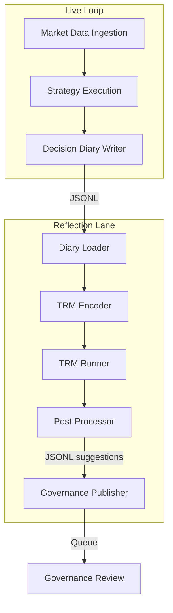
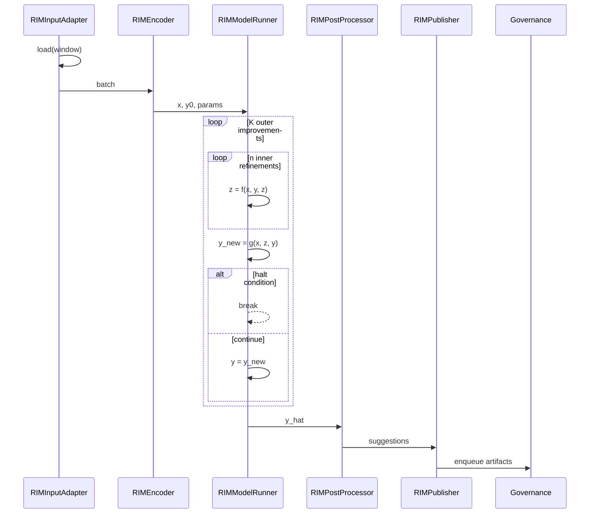

# Reflection Intelligence Module (RIM) — TRM Design

## Executive Summary

The Reflection Intelligence Module (RIM) introduces a Tiny Recursive Model (TRM) runner that asynchronously inspects Decision Diaries and produces advisory suggestions for governance review. It operates off the critical path, refining candidate insights across a lightweight recursive loop before publishing JSONL artifacts to `artifacts/rim_suggestions/`. This design outlines data contracts, interfaces, telemetry, and safety rails required for a controlled rollout without modifying live trading logic.

## System Architecture



## TRM Loop Sequence



> See [docs/design/mermaid_assets/trm_loop.md](../design/mermaid_assets/trm_loop.md) for reusable Mermaid source.

## Data Contracts

### DecisionDiaryEntry

| Field | Type | Description |
| --- | --- | --- |
| `schema_version` | string (`"rim.v1"`) | Contract version. |
| `input_hash` | string | SHA-256 hash of source diary slice. |
| `model_hash` | string | Placeholder (`"n/a"` in shadow mode). |
| `config_hash` | string | Hash of config used during write. |
| `timestamp` | string (ISO-8601) | Event time. |
| `instrument` | string | Symbol or asset identifier. |
| `strategy_id` | string | Strategy identifier. |
| `features_digest` | object | Key aggregates powering reflection. |
| `belief_state_summary` | object | Lightweight posterior/state summary. |
| `action` | string | Executed decision label. |
| `risk_flags` | array[string] | Flags raised during execution. |
| `pnl` | number | Profit/loss delta. |
| `outcome_labels` | array[string] | Post-hoc annotations (e.g., win/loss). |

### RIMInputBatch

| Field | Type | Description |
| --- | --- | --- |
| `schema_version` | string (`"rim.v1"`) | Contract version. |
| `input_hash` | string | Aggregate hash of included entries. |
| `model_hash` | string | Hash of TRM weights (shadow mode uses stub). |
| `config_hash` | string | Hash of active configuration. |
| `window` | object | `{ "start": ISO, "end": ISO, "minutes": int }`. |
| `entries` | array[DecisionDiaryEntry] | Raw diary slice. |
| `aggregates` | object | Summary stats (counts, pnl aggregates, flags). |

### RIMSuggestion

| Field | Type | Description |
| --- | --- | --- |
| `schema_version` | string (`"rim.v1"`) | Contract version. |
| `input_hash` | string | Hash of originating batch. |
| `model_hash` | string | Hash of TRM weights used. |
| `config_hash` | string | Hash of config used for inference. |
| `suggestion_id` | string | Deterministic UUID for audit. |
| `type` | enum | `WEIGHT_ADJUST \| STRATEGY_FLAG \| EXPERIMENT_PROPOSAL`. |
| `payload` | object | Type-specific recommendation body. |
| `confidence` | number [0,1] | Model confidence. |
| `rationale` | string | Human-readable explanation. |
| `audit_ids` | array[string] | Cross-links to diary entries. |
| `created_at` | string (ISO-8601) | Suggestion emission time. |

Canonical schemas live in [`interfaces/rim_types.json`](../../interfaces/rim_types.json).

## Interfaces

```python
class RIMInputAdapter:
    def load(self, window) -> RIMInputBatch: ...

class RIMEncoder:
    def encode(self, batch) -> tuple[x, y0]: ...

class RIMModelRunner:
    def run(self, x, y0, params) -> y_hat: ...

class RIMPostProcessor:
    def to_suggestions(self, y_hat) -> list[RIMSuggestion]: ...

class RIMPublisher:
    def publish(self, suggestions: list[RIMSuggestion]) -> ArtifactRef: ...
```

## Latency Stance

RIM operates asynchronously. Runs occur at end-of-session or scheduled intervals (`window_minutes` config) and **never** block live decision loops.

## Safety Controls

- Governance approval required prior to acting on suggestions.
- `enable_governance_gate` must remain `true`; publishers only enqueue to the policy ledger queue.
- Configuration `kill_switch` halts emissions while allowing diagnostics.
- Telemetry captures runtime percentiles and suggestion counts to spot anomalies.

## Configuration Keys

Referenced in [`config/reflection/rim.config.example.yml`](../../config/reflection/rim.config.example.yml):

- `window_minutes`, `min_entries`, `suggestion_cap`, `confidence_floor`
- `enable_governance_gate`, `publish_channel`, `kill_switch`
- `telemetry.log_dir`
- `trm_params.K_outer`, `trm_params.n_inner`, `trm_params.halt_enabled`

## Training Plan (Documentation Only)

1. Source supervised labels from simulation/backtest outcomes using Decision Diaries plus curated annotations.
2. Periodically retrain (monthly/quarterly) with drift checks on feature distributions and suggestion acceptance.
3. Maintain shadow datasets for ablations and fairness/robustness audits.

## Evaluation Plan

- **Precision/Recall:** Compare suggestions against governance decisions and post-hoc labels.
- **Acceptance Rate:** Track governance-approved suggestions vs. total emitted.
- **Downstream Impact:** Measure changes to Sharpe, drawdown, and win/loss rates during pilots.
- **Ablations:** Remove latent updates (`n_inner=0`) or reduce outer loops to assess TRM contribution.

## Telemetry

Monitor:

- `p50`/`p95` runtime per batch.
- Suggestion emission rate (per window and per strategy).
- Governance acceptance percentage and impact deltas (Sharpe, drawdown).

## Risks & Mitigations

| Risk | Mitigation |
| --- | --- |
| Spurious correlations in diaries | Use simulation diversity, cross-validation, and governance reviews. |
| Regime shifts | Rolling retrains with drift detection on aggregates. |
| Over-suggestion / alert fatigue | Enforce `suggestion_cap` and `confidence_floor`; monitor acceptance. |

## Acceptance Criteria Checklist

- [ ] Shadow run emits JSONL suggestions matching `interfaces/rim_types.json`.
- [ ] Governance gate loads suggestions without errors.
- [ ] Telemetry file contains runtime + acceptance metrics.
- [ ] Markdown lint & link check pass.

## Non-regression Checklist

- [ ] No changes under `risk/` or `execution/` packages.
- [ ] No new heavy ML dependencies in requirements.

## Dependencies & Open Questions

- Confirm governance ingestion API for policy ledger queue.
- Define retention enforcement job (cron or governance service).
- Align with data platform on diary enrichment cadence.
