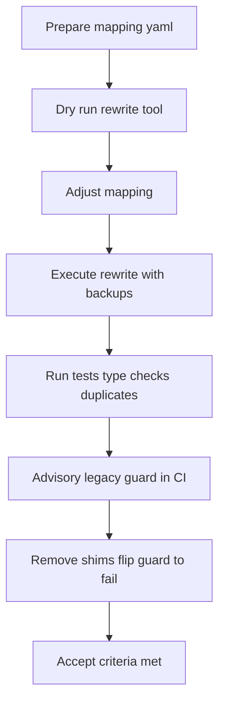

# DE-SHIMMIFICATION PLAN: Canonical-only imports and import rewrite blueprint

This document is the single source of truth for removing legacy shims and enforcing canonical-only imports across the repository. It includes an actionable plan, mapping tables, automated rewrite blueprint, CI guardrails, PR breakdown, acceptance criteria, rollback guidance, and an appendix with the import mapping schema.

Links in this plan are verified against the repository at time of writing:
- Duplicate report: [docs/reports/duplicate_map.json](docs/reports/duplicate_map.json)
- Duplicate scanner entrypoint: [duplicate_map.py](scripts/cleanup/duplicate_map.py:1)
- Duplicate CI guard: [scripts/cleanup/check_no_new_duplicates.py](scripts/cleanup/check_no_new_duplicates.py:1)


## 1) Executive summary

Rationale: De-shimmify the codebase to reduce indirection, improve static analysis and type-checking, and simplify maintenance. Enforce canonical-only imports so symbols are defined in one authoritative location. The duplicate scanner confirms class duplicates are zero and only function duplicates for the main entrypoint are permitted:
- Classes duplicate groups: 0
- Functions duplicate groups: 1 (allowed: main) per [docs/reports/duplicate_map.json](docs/reports/duplicate_map.json)

Outcome: Internal code imports only from canonical modules under src, with optional minimal public API facades isolated and guarded by CI to prevent reintroduction of legacy imports.


## 2) Target state and rules

- Canonical-only imports in internal code:
  - Standardize on absolute import style using the src package prefix (for consistency and clarity), e.g., from src.core.event_bus import EventBus.
  - Internal code must not import from shim or re-export modules.

- Optional, minimal public API facades (facade modules keep import stability for external callers only):
  - Keep a small allow-list of facades, but disallow their use by internal code via CI guard:
    - [src/core/sensory_organ.py](src/core/sensory_organ.py) — retains CoreSensoryOrgan shim for legacy factories; do not import SensoryOrgan from here internally.
    - [src/phase2d_integration_validator.py](src/phase2d_integration_validator.py) — top-level façade that re-exports the canonical validator; internal code must target [src/validation/phase2d_integration_validator.py](src/validation/phase2d_integration_validator.py).
    - [src/intelligence/red_team_ai.py](src/intelligence/red_team_ai.py) — façade re-export for Red Team AI family.
    - [src/performance/__init__.py](src/performance/__init__.py) — façade re-export for get_global_cache; replace internally with [src/core/performance/market_data_cache.py](src/core/performance/market_data_cache.py).
    - [src/trading/models.py](src/trading/models.py) — façade re-export for Position; replace internally with [src/trading/models/position.py](src/trading/models/position.py).
    - [src/sensory/models/__init__.py](src/sensory/models/__init__.py) — façade re-export for SensoryReading; internal code must import from [src/sensory/organs/dimensions/base_organ.py](src/sensory/organs/dimensions/base_organ.py).
    - [src/operational/event_bus.py](src/operational/event_bus.py) — temporary shim for EventBus to be removed after PR2.

- CI enforcement:
  - Duplicates scanner guard: require zero duplicate class groups; allow function duplicates only for main via [scripts/cleanup/check_no_new_duplicates.py](scripts/cleanup/check_no_new_duplicates.py:1).
  - Legacy-import detector: fail CI if imports from legacy shim modules are found outside the sanctioned facades.


## 3) Inventory of shims and canonical targets (source → target)

Legend:
- Search pattern examples are illustrative; the automated rewrite will match ast Import/ImportFrom nodes for these modules/symbols.
- Replacement path shows the canonical module to import to.
- Rename/alias indicates whether a symbol is renamed or requires an alias.

| Source (shim/re-export) | Typical legacy import patterns to search | Replacement canonical import path(s) | Symbols impacted | Rename/alias |
|---|---|---|---|---|
| [src/operational/event_bus.py](src/operational/event_bus.py) → [src/core/event_bus.py](src/core/event_bus.py) | from operational.event_bus import EventBus; from src.operational.event_bus import EventBus; import operational.event_bus as bus | from src.core.event_bus import EventBus, event_bus, publish_event, subscribe_to_event, unsubscribe_from_event, start_event_bus, stop_event_bus | EventBus, event_bus, publish_event, subscribe_to_event, unsubscribe_from_event, start_event_bus, stop_event_bus | No rename |
| [src/performance/__init__.py](src/performance/__init__.py) get_global_cache → [src/core/performance/market_data_cache.py](src/core/performance/market_data_cache.py) | from performance import get_global_cache; from src.performance import get_global_cache | from src.core.performance.market_data_cache import get_global_cache | get_global_cache | No rename |
| [src/performance/__init__.py](src/performance/__init__.py) GlobalCache (deprecated) | from performance import GlobalCache | Prefer accessor: from src.core.performance.market_data_cache import get_global_cache; optional direct: from src.core.performance.market_data_cache import MarketDataCache | GlobalCache | Rename GlobalCache → MarketDataCache or usage of get_global_cache |
| [src/trading/models.py](src/trading/models.py) → [src/trading/models/position.py](src/trading/models/position.py) | from trading.models import Position; from src.trading.models import Position | from src.trading.models.position import Position | Position | No rename |
| [src/sensory/models/__init__.py](src/sensory/models/__init__.py) → [src/sensory/organs/dimensions/base_organ.py](src/sensory/organs/dimensions/base_organ.py) | from sensory.models import SensoryReading; from src.sensory.models import SensoryReading | from src.sensory.organs.dimensions.base_organ import SensoryReading | SensoryReading | No rename |
| [src/core/sensory_organ.py](src/core/sensory_organ.py) → [src/sensory/organs/dimensions/base_organ.py](src/sensory/organs/dimensions/base_organ.py) | from core.sensory_organ import SensoryOrgan; from src.core.sensory_organ import SensoryOrgan | from src.sensory.organs.dimensions.base_organ import SensoryOrgan | SensoryOrgan | No rename; keep CoreSensoryOrgan only for legacy factory usage |
| [src/intelligence/red_team_ai.py](src/intelligence/red_team_ai.py) → [src/thinking/adversarial/red_team_ai.py](src/thinking/adversarial/red_team_ai.py) | from intelligence.red_team_ai import RedTeamAI; from src.intelligence.red_team_ai import StrategyAnalyzer, WeaknessDetector, AttackGenerator, ExploitDeveloper, RedTeamAI | from src.thinking.adversarial.red_team_ai import StrategyAnalyzer, WeaknessDetector, AttackGenerator, ExploitDeveloper, RedTeamAI | listed symbols | No rename |
| [src/phase2d_integration_validator.py](src/phase2d_integration_validator.py) → [src/validation/phase2d_integration_validator.py](src/validation/phase2d_integration_validator.py) | from phase2d_integration_validator import Phase2DIntegrationValidator; from src.phase2d_integration_validator import Phase2DIntegrationValidator | from src.validation.phase2d_integration_validator import Phase2DIntegrationValidator | Phase2DIntegrationValidator | No rename |
| [src/thinking/sentient_adaptation_engine.py](src/thinking/sentient_adaptation_engine.py) → [src/intelligence/sentient_adaptation.py](src/intelligence/sentient_adaptation.py) | from thinking.sentient_adaptation_engine import SentientAdaptationEngine; from src.thinking.sentient_adaptation_engine import SentientAdaptationEngine | from src.intelligence.sentient_adaptation import SentientAdaptationEngine | SentientAdaptationEngine | No rename |
| Order book models: Canonical already at [src/trading/order_management/order_book/snapshot.py](src/trading/order_management/order_book/snapshot.py) | Any import of OrderBookSnapshot/OrderBookLevel from non-canonical paths | from src.trading.order_management.order_book.snapshot import OrderBookSnapshot, OrderBookLevel | OrderBookSnapshot, OrderBookLevel | No rename |
| Pattern memory alias in [src/thinking/memory/pattern_memory.py](src/thinking/memory/pattern_memory.py) | from src.thinking.memory.pattern_memory import MemoryEntry | from src.thinking.memory.pattern_memory import PatternMemoryEntry [as MemoryEntry] | MemoryEntry → PatternMemoryEntry | Rename to PatternMemoryEntry; script can preserve alias as MemoryEntry where safe |

Notes:
- Consumers already updated in representative places: for order book e.g., [src/trading/strategies/order_book_analyzer.py](src/trading/strategies/order_book_analyzer.py), [src/sensory/organs/dimensions/base_organ.py](src/sensory/organs/dimensions/base_organ.py), and data integration modules. The rewrite tool will handle remaining stragglers.
- Catch-all policy: The rewrite tool will also detect import-from modules that are pure re-exports (modules that only import-and-expose symbols from canonical modules) and suggest mapping entries where not explicitly listed, see Section 4.


### 3A) Phase 1 canonicalization status — Completed

This batch promotes the following surfaces to their canonical modules and normalizes imports across src/ and tests/ (no behavior changes):

- Volatility surface (canonical module):
  - [src/sensory/what/volatility_engine.py](src/sensory/what/volatility_engine.py:1)
  - Canonical symbols: VolConfig, VolatilityEngine
  - Export contract: __all__ = ["VolConfig", "VolatilityEngine"]
  - Real implementation discovery: no existing VolatilityEngine class elsewhere; canonical now houses typed shim for VolatilityEngine and the VolConfig dataclass.

- Trading Execution surface (canonical module):
  - [src/trading/execution/execution_engine.py](src/trading/execution/execution_engine.py:1)
  - Canonical symbols: ExecutionEngine
  - Export contract: __all__ = ["ExecutionEngine"]
  - Real implementation discovery: no alternate internal ExecutionEngine classes found; package __init__ retains non-canonical re-export but is unused internally.

- Real Sensory Organ surface (canonical module):
  - [src/sensory/real_sensory_organ.py](src/sensory/real_sensory_organ.py:1)
  - Canonical symbols: RealSensoryOrgan
  - Export contract: __all__ = ["RealSensoryOrgan"]
  - Removed placeholder shim (re-export only): [src/sensory/organs/dimensions/real_sensory_organ.py](src/sensory/organs/dimensions/real_sensory_organ.py:1)

Import normalization summary (src/ + tests/ only):
- Volatility surface: 1 import alignment (see migration notes)
- Execution surface: 0 (already canonical)
- Real Sensory Organ: 0 (no internal uses of the shim)
- Total: 1

Migration notes (anchors):
- [src/data_foundation/config/vol_config.py](src/data_foundation/config/vol_config.py:22)
  - Before → after:
    - from src.sensory.what.volatility_engine import VolConfig as _VolConfig  →  from src.sensory.what.volatility_engine import VolConfig, VolatilityEngine
- No other legacy imports for these surfaces were found under src/ or tests/.

Notes:
- Scripts under scripts/ still reference historical helpers like vol_signal; these are out-of-scope for Phase 1 and intentionally untouched.

## 4) Automated import rewrite blueprint

Tooling deliverable: [scripts/cleanup/rewrite_imports.py](scripts/cleanup/rewrite_imports.py) (to be implemented in PR1)

Scope and traversal:
- Walk all *.py under src.
- Exclude directories: .git, .idea, .vscode, .venv, venv, env, __pycache__, node_modules, dist, build, backup, reports, mlruns, docs (except code examples if explicitly included via allow-list).
- Parse files with ast to locate Import and ImportFrom nodes.

Declarative mapping:
- Mapping is stored as YAML at [docs/development/import_rewrite_map.yaml](docs/development/import_rewrite_map.yaml).
- The tool loads the mapping and applies module- and symbol-level rules.
- Supports multiple legacy module spellings for the same target, e.g., operational.event_bus and src.operational.event_bus both remap to src.core.event_bus.

Rewrite behavior:
- Preserve aliasing: if legacy code used as xyz, the new import retains aliasing unless the mapping specifies a rename override.
- Star-imports: do not expand; emit a warning with file and line. If --strict is set, treat unresolved star-imports from legacy modules as errors.
- Atomic writes: write to a temporary file, preserve original as .orig alongside, then replace. Provide a --no-backup option if needed when running on a Git branch.
- Summary report: at the end print a per-mapping-key count of applied changes and list changed files.

CLI flags:
- --root: default src
- --map: default docs/development/import_rewrite_map.yaml
- --dry-run: do not modify files, print intended changes
- --strict: fail if any unresolved legacy imports remain after rewriting
- --exclude: glob(s) to exclude additional paths (may be provided multiple times)
- --backup/--no-backup: control .orig backup creation
- --verbose: emit detailed per-file rewrite logs

First version of the import rewrite mapping (canonical style: src.*):

Inline table (human view):
- operational.event_bus[*] → src.core.event_bus[*]
- src.operational.event_bus[*] → src.core.event_bus[*]
- performance:get_global_cache → src.core.performance.market_data_cache:get_global_cache
- src.performance:get_global_cache → src.core.performance.market_data_cache:get_global_cache
- performance:GlobalCache → src.core.performance.market_data_cache:MarketDataCache (prefer accessor)
- trading.models:Position → src.trading.models.position:Position
- src.trading.models:Position → src.trading.models.position:Position
- sensory.models:SensoryReading → src.sensory.organs.dimensions.base_organ:SensoryReading
- src.sensory.models:SensoryReading → src.sensory.organs.dimensions.base_organ:SensoryReading
- core.sensory_organ:SensoryOrgan → src.sensory.organs.dimensions.base_organ:SensoryOrgan
- src.core.sensory_organ:SensoryOrgan → src.sensory.organs.dimensions.base_organ:SensoryOrgan
- intelligence.red_team_ai:[StrategyAnalyzer,WeaknessDetector,AttackGenerator,ExploitDeveloper,RedTeamAI] → src.thinking.adversarial.red_team_ai:[same]
- src.intelligence.red_team_ai:[...] → src.thinking.adversarial.red_team_ai:[same]
- phase2d_integration_validator:Phase2DIntegrationValidator → src.validation.phase2d_integration_validator:Phase2DIntegrationValidator
- src.phase2d_integration_validator:Phase2DIntegrationValidator → src.validation.phase2d_integration_validator:Phase2DIntegrationValidator
- thinking.sentient_adaptation_engine:SentientAdaptationEngine → src.intelligence.sentient_adaptation:SentientAdaptationEngine
- src.thinking.sentient_adaptation_engine:SentientAdaptationEngine → src.intelligence.sentient_adaptation:SentientAdaptationEngine
- src.thinking.memory.pattern_memory:MemoryEntry → src.thinking.memory.pattern_memory:PatternMemoryEntry (may alias back to MemoryEntry)

Suggested serializable YAML schema (example entries):

```yaml
version: 1
canonical_style: src  # enforce src.* absolute imports

mappings:
  # Module-level full re-export replacement
  - sources:
      - operational.event_bus
      - src.operational.event_bus
    target_module: src.core.event_bus
    symbols: ["*"]             # star means keep the imported names as-is
    rename: {}                 # optional symbol rename map

  # Function accessor from package __init__ facade to canonical module
  - sources:
      - performance
      - src.performance
    target_module: src.core.performance.market_data_cache
    symbols:
      - get_global_cache

  # Class re-export from facade file to canonical file
  - sources:
      - trading.models
      - src.trading.models
    target_module: src.trading.models.position
    symbols:
      - Position

  # Sensory primitives
  - sources:
      - sensory.models
      - src.sensory.models
    target_module: src.sensory.organs.dimensions.base_organ
    symbols:
      - SensoryReading

  - sources:
      - core.sensory_organ
      - src.core.sensory_organ
    target_module: src.sensory.organs.dimensions.base_organ
    symbols:
      - SensoryOrgan

  # Red team AI family
  - sources:
      - intelligence.red_team_ai
      - src.intelligence.red_team_ai
    target_module: src.thinking.adversarial.red_team_ai
    symbols:
      - StrategyAnalyzer
      - WeaknessDetector
      - AttackGenerator
      - ExploitDeveloper
      - RedTeamAI

  # Phase2D validator
  - sources:
      - phase2d_integration_validator
      - src.phase2d_integration_validator
    target_module: src.validation.phase2d_integration_validator
    symbols:
      - Phase2DIntegrationValidator

  # Sentient adaptation engine
  - sources:
      - thinking.sentient_adaptation_engine
      - src.thinking.sentient_adaptation_engine
    target_module: src.intelligence.sentient_adaptation
    symbols:
      - SentientAdaptationEngine

  # Symbol rename
  - sources:
      - src.thinking.memory.pattern_memory
    target_module: src.thinking.memory.pattern_memory
    symbols:
      - MemoryEntry
    rename:
      MemoryEntry: PatternMemoryEntry
    preserve_alias: true        # if true, rewrite to 'PatternMemoryEntry as MemoryEntry' where safe
```

Guardrails in the tool:
- If a file contains a legacy import not covered by the mapping, print a warning; with --strict, exit non-zero.
- If a symbol is imported via star-import from a legacy module, log the file and line, and with --strict fail to prompt manual remediation.
- Always emit a machine-readable JSON summary that includes per-mapping hit counts.


## 5) CI and pre-commit enforcement

- Duplicates guard:
  - Run [scripts/cleanup/check_no_new_duplicates.py](scripts/cleanup/check_no_new_duplicates.py:1) in CI (default allow-list includes main).
  - This refreshes [docs/reports/duplicate_map.json](docs/reports/duplicate_map.json) by calling [duplicate_map.py](scripts/cleanup/duplicate_map.py:1) and fails on any class duplicate group or disallowed function duplicates.

- Legacy import guard (choose one):
  1) Simple grep:
     - Block imports of legacy modules in internal code (allow-list specific facades if required).
     - Example patterns to block, both bare and src.-prefixed:
       - operational.event_bus, src.operational.event_bus
       - performance (when used as facade for get_global_cache)
       - trading.models, src.trading.models
       - sensory.models, src.sensory.models
       - core.sensory_organ, src.core.sensory_organ
       - intelligence.red_team_ai, src.intelligence.red_team_ai
       - phase2d_integration_validator, src.phase2d_integration_validator
       - thinking.sentient_adaptation_engine, src.thinking.sentient_adaptation_engine
     - Example command (Linux CI):
       - git grep -nE "from (operational|src\.operational)\.event_bus|from (trading|src\.trading)\.models(?!\.position)|from (sensory|src\.sensory)\.models|from (core|src\.core)\.sensory_organ|from (intelligence|src\.intelligence)\.red_team_ai|from (phase2d_integration_validator|src\.phase2d_integration_validator)|from (thinking|src\.thinking)\.sentient_adaptation_engine" -- 'src/**/*.py' ':!src/core/sensory_organ.py' ':!src/phase2d_integration_validator.py' ':!src/intelligence/red_team_ai.py' ':!src/performance/__init__.py' ':!src/trading/models.py' ':!src/sensory/models/__init__.py'
       - Fail CI if any matches are found.
  2) Lightweight static check (recommended for Windows/Linux parity):
     - Implement a small Python checker (proposed path): scripts/cleanup/check_legacy_imports.py
     - It should parse AST across src, detect any Import/ImportFrom for blacklisted modules, and fail unless the import originates from an allow-listed facade path.

- Optional pre-commit hooks:
  - Add a pre-commit configuration to invoke both duplicate and legacy-import guards for fast feedback prior to CI.

Example pre-commit snippet (to be added in PR1):
```yaml
repos:
  - repo: local
    hooks:
      - id: emp-duplicates-guard
        name: EMP duplicate guard
        entry: python scripts/cleanup/check_no_new_duplicates.py --root src --out docs/reports --min-count 2
        language: system
        pass_filenames: false

      - id: emp-legacy-import-guard
        name: EMP legacy import guard
        entry: python scripts/cleanup/check_legacy_imports.py --root src
        language: system
        pass_filenames: false
```


## 6) PR breakdown and timeline

- PR1: Introduce rewrite tool and advisory audit
  - Add [scripts/cleanup/rewrite_imports.py](scripts/cleanup/rewrite_imports.py) and first pass mapping at [docs/development/import_rewrite_map.yaml](docs/development/import_rewrite_map.yaml).
  - Run the tool in --dry-run mode to produce an audit report and fix mapping gaps.
  - Execute rewrite on a feature branch with backups and commit changes. Keep shims present. Ensure tests and linters are green.
  - Add CI wiring for duplicates guard and non-failing legacy import detector (warn-only).
  - Update documentation (this plan, CHANGELOG notes on canonical imports).

- PR2: Enforce and remove
  - Remove unused shims and re-export modules where feasible:
    - [src/operational/event_bus.py](src/operational/event_bus.py)
    - [src/performance/__init__.py](src/performance/__init__.py) (keep if needed for external API only)
    - [src/trading/models.py](src/trading/models.py)
    - [src/sensory/models/__init__.py](src/sensory/models/__init__.py)
    - [src/intelligence/red_team_ai.py](src/intelligence/red_team_ai.py)
    - [src/phase2d_integration_validator.py](src/phase2d_integration_validator.py)
    - Optionally remove the SensoryOrgan re-export from [src/core/sensory_organ.py](src/core/sensory_organ.py) while retaining CoreSensoryOrgan for factory semantics.
  - Flip CI legacy import guard to failing on any internal use.
  - Confirm duplicate scanner still reports zero class duplicate groups and function duplicates only for main.
  - Document removed modules in CHANGELOG with migration notes.

- PR3 (optional): Public API consolidation
  - If external consumers exist, consolidate sanctioned public facades under a clearly named package (e.g., src/public) or a single api module, and update docs accordingly.
  - Clarify long-term support surface and deprecation cadence.


## 7) Acceptance criteria

- No imports from legacy shim modules in internal code (final check).
- All internal imports reference canonical modules per the mapping and canonical style (src.*).
- Duplicate scanner shows: class duplicate groups 0; function duplicates only for main.
- CI guards (duplicates and legacy import detector) are in place and enforced.
- Optional: public API facades exist only where justified and are not used internally.


## 8) Rollback and risk

- If the rewrite causes a break, temporarily re-enable a specific shim module or add a targeted mapping entry and re-run CI.
- Keep PR1 atomic and reversible: use a feature branch and create .orig backups during rewrite to simplify reverts.
- Validate with:
  - Static type checks (basedpyright/mypy as available),
  - Test suite (pytests),
  - Duplicate scanner via [scripts/cleanup/check_no_new_duplicates.py](scripts/cleanup/check_no_new_duplicates.py:1).

Risk mitigations:
- Dry-run and summary reports before applying changes.
- Strict mode in CI only after PR1 lands and confidence is established.
- Keep the PatternMemory rename using alias preservation to reduce risk of breaking code that refers to MemoryEntry.


## 9) Appendix

A) Top-level canonical map (succinct):
- Event bus: [src/core/event_bus.py](src/core/event_bus.py); shim [src/operational/event_bus.py](src/operational/event_bus.py)
- Global cache: [src/core/performance/market_data_cache.py](src/core/performance/market_data_cache.py); façade [src/performance/__init__.py](src/performance/__init__.py)
- Position: [src/trading/models/position.py](src/trading/models/position.py); façade [src/trading/models.py](src/trading/models.py)
- Order book models: [src/trading/order_management/order_book/snapshot.py](src/trading/order_management/order_book/snapshot.py)
- Sensory primitives: [src/sensory/organs/dimensions/base_organ.py](src/sensory/organs/dimensions/base_organ.py); façade [src/sensory/models/__init__.py](src/sensory/models/__init__.py); SensoryOrgan re-export in [src/core/sensory_organ.py](src/core/sensory_organ.py)
- Red Team AI family: [src/thinking/adversarial/red_team_ai.py](src/thinking/adversarial/red_team_ai.py); façade [src/intelligence/red_team_ai.py](src/intelligence/red_team_ai.py)
- Phase2D validator: [src/validation/phase2d_integration_validator.py](src/validation/phase2d_integration_validator.py); façade [src/phase2d_integration_validator.py](src/phase2d_integration_validator.py)
- Sentient adaptation: [src/intelligence/sentient_adaptation.py](src/intelligence/sentient_adaptation.py); façade [src/thinking/sentient_adaptation_engine.py](src/thinking/sentient_adaptation_engine.py)
- Pattern memory naming: [src/thinking/memory/pattern_memory.py](src/thinking/memory/pattern_memory.py) has PatternMemoryEntry with MemoryEntry alias

B) Expected YAML schema for import_rewrite_map with examples:
See Section 4 for the schema and initial entries.

C) Stepwise operational checklist:

- Mapping and audit
  - [ ] Confirm canonical import style as src.* across repo.
  - [ ] Review and finalize [docs/development/import_rewrite_map.yaml](docs/development/import_rewrite_map.yaml) with entries listed in Section 4.
  - [ ] Run rewrite tool in --dry-run to generate an audit; update mapping for any missed re-exports.
- Rewrite and verify
  - [ ] Execute rewrite across src with backups (.orig) on a feature branch.
  - [ ] Run tests, type checks, and duplicate scanner guard [scripts/cleanup/check_no_new_duplicates.py](scripts/cleanup/check_no_new_duplicates.py:1).
  - [ ] Inspect summary of changed files and per-mapping hit counts; spot-check risky areas.
- CI and policy
  - [ ] Enable advisory legacy import guard (warn-only).
  - [ ] After green tests, flip guard to failing and remove unused shims per PR2.
- Cleanup
  - [ ] Remove shims and deprecated re-exports as listed in Section 6 (PR2).
  - [ ] Update CHANGELOG with removed modules and migration notes.
  - [ ] Optional: consolidate public API facades in PR3.

D) Flow overview (Mermaid):



E) Reference: Scanner entrypoint for duplicates
- [duplicate_map.py](scripts/cleanup/duplicate_map.py:1) generates [docs/reports/duplicate_map.json](docs/reports/duplicate_map.json) and associated CSVs.
- CI guard script: [scripts/cleanup/check_no_new_duplicates.py](scripts/cleanup/check_no_new_duplicates.py:1) ensures no regressions.