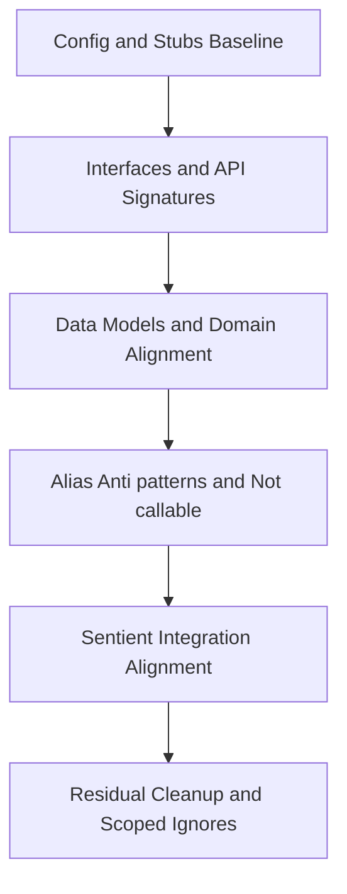

# Mypy Remediation Plan (Planning-Only, No Code Edits)

Repository root: [emp_proving_ground_v1-1](README.md:1)

Document path: [docs/development/plans/mypy_remediation_plan.md](docs/development/plans/mypy_remediation_plan.md:1)

This plan drives mypy errors to zero or to a minimal, explicitly documented residual set covered by local stubs or scoped ignore markers. It defines phased batches, per-batch success criteria and rollback, and an overall acceptance gate with a snapshot requirement.

Note on configuration: The plan assumes a mypy configuration exists via either [pyproject.toml](pyproject.toml:1) or [mypy.ini](mypy.ini:1) or [setup.cfg](setup.cfg:1). If multiple exist, prefer pyproject.toml as the single source of truth and keep others in sync or deprecate via documentation.

---

## 1) Error Categorization Map (file-level targets)

- Missing type stubs and config alignment
  - Ensure PyYAML types are available for:
    - [src/core/configuration.py](src/core/configuration.py:1)
    - [src/data_foundation/config/sizing_config.py](src/data_foundation/config/sizing_config.py:1)
  - Enhanced sensory imports not found; plan local shims under [stubs/src/](stubs/src/) for targets referenced by:
    - [src/sensory/organs/dimensions/integration_orchestrator.py](src/sensory/organs/dimensions/integration_orchestrator.py:1)

- Core interface/base-class mismatches
  - Validate across base and interface definitions vs usage:
    - [src/core/base.py](src/core/base.py:1)
    - [src/core/interfaces.py](src/core/interfaces.py:1)
    - Usage sites under [src/sensory/organs/](src/sensory/organs/)
    - [src/evolution/mutation/gaussian_mutation.py](src/evolution/mutation/gaussian_mutation.py:1)

- Async event bus API mismatches
  - Reconcile signatures between:
    - [src/operational/bus/async_event_bus.py](src/operational/bus/async_event_bus.py:1)
    - [src/ui/ui_manager.py](src/ui/ui_manager.py:1)

- Data model attribute/type expectations
  - MarketData volatility, FusedDataPoint volume typing, and model coherence:
    - [src/data_integration/data_fusion.py](src/data_integration/data_fusion.py:1)

- Type alias redefinitions and anti-patterns
  - Conflicts and assign-to-type mistakes:
    - [src/genome/models/genome_adapter.py](src/genome/models/genome_adapter.py:1)
    - [src/validation/honest_validation_framework.py](src/validation/honest_validation_framework.py:1)
    - [src/validation/real_market_validation.py](src/validation/real_market_validation.py:1)
    - [src/validation/phase2d_simple_integration.py](src/validation/phase2d_simple_integration.py:1)

- Object-not-callable patterns in engine wiring
  - Investigate factory vs instance usage in:
    - [src/orchestration/enhanced_intelligence_engine.py](src/orchestration/enhanced_intelligence_engine.py:1)

- Portfolio monitor typing and models
  - Align monitor with portfolio/trading models:
    - [src/trading/portfolio/real_portfolio_monitor.py](src/trading/portfolio/real_portfolio_monitor.py:1)
    - Model definitions under [src/trading/models/](src/trading/models/)

- Return/param typing corrections
  - Ensure concrete return and param types:
    - [src/thinking/analysis/market_analyzer.py](src/thinking/analysis/market_analyzer.py:1)
    - [src/thinking/thinking_manager.py](src/thinking/thinking_manager.py:1)

- Sentient adaptation constructor and method alignment
  - Cross-check with sentient modules:
    - [src/intelligence/sentient_adaptation.py](src/intelligence/sentient_adaptation.py:1)
    - [src/sentient/adaptation/adaptation_controller.py](src/sentient/adaptation/adaptation_controller.py:1)
    - Modules under [src/sentient/](src/sentient/)

- Ecosystem optimizer mapping/sequence typing
  - Tighten mapping and sequence types:
    - [src/ecosystem/optimization/ecosystem_optimizer.py](src/ecosystem/optimization/ecosystem_optimizer.py:1)

Existing local stubs detected under [stubs/](stubs/):
- [stubs/duckdb/](stubs/duckdb/)
- [stubs/faiss/](stubs/faiss/)
- [stubs/market_intelligence/](stubs/market_intelligence/)
- [stubs/prometheus_client/](stubs/prometheus_client/)
- [stubs/requests/](stubs/requests/)
- [stubs/simplefix/](stubs/simplefix/)
- [stubs/sklearn/](stubs/sklearn/)
- [stubs/src/](stubs/src/)
- [stubs/torch/](stubs/torch/)
- [stubs/yfinance/](stubs/yfinance/)

---

## 2) Phased Remediation Strategy

- P0: Establish mypy config alignment and stub availability.
- P1: Fix core interface and async bus signature mismatches.
- P2: Align data model types and portfolio monitor with models.
- P3: Resolve type alias redefinitions, assign-to-type errors, and not-callable.
- P4: Reconcile sentient adaptation constructors and methods across packages.
- P5: Residual cleanup with minimal, justified ignore markers or local stubs.

---

## 3) Batches: Scope, Files, Approach, Success Criteria, Risks

Batch P0.1 — Mypy config and stub path baseline
- Scope:
  - Confirm single config authority in [pyproject.toml](pyproject.toml:1) or [mypy.ini](mypy.ini:1).
  - Ensure mypy sees local stubs under [stubs/src/](stubs/src/) using mypy_path.
  - Add external stub requirement for PyYAML if not present.
- Files:
  - [pyproject.toml](pyproject.toml:1) or [mypy.ini](mypy.ini:1)
  - [stubs/src/](stubs/src/)
- Approach:
  - Configure mypy_path to include stubs/src and ensure namespace packages are enabled if needed.
  - Add types-PyYAML to dev requirements; if using requirements split, place in [requirements/](requirements/).
  - Keep strict settings enabled; add per-module overrides instead of global relaxations.
- Success Criteria:
  - Running mypy with only config discovery errors returns none; missing-import errors drop for modules covered by existing stubs.
- Risks:
  - Multiple configs competing; resolve by unifying into a single file and documenting deprecation of others.

Batch P0.2 — Local shim stubs for missing enhanced sensory imports
- Scope:
  - Create minimal .pyi modules for unresolved imports referenced by [src/sensory/organs/dimensions/integration_orchestrator.py](src/sensory/organs/dimensions/integration_orchestrator.py:1).
- Files:
  - [src/sensory/organs/dimensions/integration_orchestrator.py](src/sensory/organs/dimensions/integration_orchestrator.py:1)
  - New local stubs under [stubs/src/](stubs/src/)
- Approach:
  - Mirror import paths exactly in stubs/src. Provide typed signatures where known; otherwise use minimal surface area with placeholders and precise Any only where unavoidable.
- Success Criteria:
  - No "Cannot find implementation or library stub" for targeted imports under integration_orchestrator.py.
- Risks:
  - Hiding real API mismatches with overly permissive Any. Mitigate by annotating only the used members and keeping TODOs.

Batch P1.1 — Core interface alignment across core and organs
- Scope:
  - Reconcile interface definitions vs usage for bases and organs.
- Files:
  - [src/core/base.py](src/core/base.py:1), [src/core/interfaces.py](src/core/interfaces.py:1)
  - Usages under [src/sensory/organs/](src/sensory/organs/)
  - [src/evolution/mutation/gaussian_mutation.py](src/evolution/mutation/gaussian_mutation.py:1)
- Approach:
  - Normalize abstract method signatures and return types; adopt structural typing via Protocols where implementation variation exists.
- Success Criteria:
  - No "Argument n to X has incompatible type" or "Missing attribute" errors in affected modules.
- Risks:
  - Cascading changes where implementations diverge materially. Prefer Protocols and narrow interfaces.

Batch P1.2 — Async event bus and UI manager signature reconciliation
- Scope:
  - Align async event bus API with UI calls.
- Files:
  - [src/operational/bus/async_event_bus.py](src/operational/bus/async_event_bus.py:1)
  - [src/ui/ui_manager.py](src/ui/ui_manager.py:1)
- Approach:
  - Ensure async signatures awaitable consistency and event payload types via TypedDict or dataclasses; tighten Callback and Listener type aliases.
- Success Criteria:
  - No "Incompatible type to await", "Function is not awaitable", or callback mismatch errors.
- Risks:
  - Runtime contract drift. Add unit typing tests where feasible as follow-up.

Batch P2.1 — Data integration model coherence
- Scope:
  - Ensure volatility and volume fields types consistent across models and fusion outputs.
- Files:
  - [src/data_integration/data_fusion.py](src/data_integration/data_fusion.py:1)
  - Model providers in [src/data_foundation/](src/data_foundation/) and [src/data_sources/](src/data_sources/)
- Approach:
  - Define clear aliases for numeric fields; consider NewType for identifiers; TypedDict or pydantic-like models can be stubbed as Protocols if runtime models vary.
- Success Criteria:
  - No attribute-not-found or incompatible assignment for MarketData and FusedDataPoint.
- Risks:
  - Hidden implicit conversions. Document units and numeric types.

Batch P2.2 — Portfolio monitor vs trading models alignment
- Scope:
  - Real portfolio monitor types matched to model definitions.
- Files:
  - [src/trading/portfolio/real_portfolio_monitor.py](src/trading/portfolio/real_portfolio_monitor.py:1)
  - [src/trading/models/](src/trading/models/)
- Approach:
  - Replace loose Dict with TypedDict or dataclasses; align Optional fields and Numerics; parametrize generics where applicable.
- Success Criteria:
  - No incompatible types between monitor and models; zero use of untyped Dict in public surfaces.
- Risks:
  - Over-constraining models that intentionally allow partials; use total=False for TypedDict when appropriate.

Batch P3.1 — Type alias redefinitions and assign-to-type fixes
- Scope:
  - Remove conflicting alias redefinitions; replace assign-to-type anti-patterns with proper variable annotations.
- Files:
  - [src/genome/models/genome_adapter.py](src/genome/models/genome_adapter.py:1)
  - [src/validation/honest_validation_framework.py](src/validation/honest_validation_framework.py:1)
  - [src/validation/real_market_validation.py](src/validation/real_market_validation.py:1)
  - [src/validation/phase2d_simple_integration.py](src/validation/phase2d_simple_integration.py:1)
- Approach:
  - Use explicit TypeAlias; separate alias names from variable names; adopt Final where constants are mutated accidentally.
- Success Criteria:
  - No "Name is not a valid type alias" or "Cannot assign to type" errors across listed files.
- Risks:
  - Downstream import cycles if aliases relocate; mitigate with local aliases and re-exports.

Batch P3.2 — Object-not-callable in enhanced intelligence engine
- Scope:
  - Distinguish factories vs instances; correct call sites or constructors.
- Files:
  - [src/orchestration/enhanced_intelligence_engine.py](src/orchestration/enhanced_intelligence_engine.py:1)
- Approach:
  - Annotate factory callables vs instantiated objects; ensure classes are initialized before method calls; tighten Callable signatures where used.
- Success Criteria:
  - No "X is not callable" or "Too many arguments for X" in the engine orchestration.
- Risks:
  - Runtime inversion of control assumptions; document factory lifecycle.

Batch P3.3 — Return and parameter typing corrections in thinking modules
- Scope:
  - Normalize analyzer and manager function signatures and return types.
- Files:
  - [src/thinking/analysis/market_analyzer.py](src/thinking/analysis/market_analyzer.py:1)
  - [src/thinking/thinking_manager.py](src/thinking/thinking_manager.py:1)
- Approach:
  - Replace implicit Any returns; add precise containers like list[str] or dict[str, float]; prefer Protocol for pluggable analyzers.
- Success Criteria:
  - No "Implicit Any" or "Incompatible return value type" in targeted files.
- Risks:
  - API surface change; consider overloads to support legacy call sites.

Batch P4 — Sentient adaptation constructor and method alignment
- Scope:
  - Align constructor signatures and method shapes across intelligence and sentient packages.
- Files:
  - [src/intelligence/sentient_adaptation.py](src/intelligence/sentient_adaptation.py:1)
  - [src/sentient/adaptation/adaptation_controller.py](src/sentient/adaptation/adaptation_controller.py:1)
  - [src/sentient/](src/sentient/)
- Approach:
  - Document required vs optional params, async vs sync methods; add Protocols where multiple concrete controllers exist; unify return types.
- Success Criteria:
  - No constructor signature mismatches or attribute missing across the sentient integration.
- Risks:
  - Multiple implementations with divergent signatures; adopt narrow Protocols and adapters.

Batch P5 — Residual cleanup and localized ignores
- Scope:
  - For unavoidable third-party gaps or legacy edges, add:
    - Narrow ignore errors inline with justification comments.
    - Targeted local stubs in [stubs/src/](stubs/src/).
- Files:
  - Residual offenders discovered after P4.
- Approach:
  - Use per-line or per-module ignore list in config overrides. Avoid global relaxations.
- Success Criteria:
  - mypy run exits 0 for all checked packages OR a short allowlist of ignores all justified in comments and plan appendix.
- Risks:
  - Ignore sprawl. Centralize and track with an allowlist file segment in config.

---

## 4) Stubs Strategy

External stub requirements
- Add types-PyYAML to development dependencies if missing; ensures typed YAML for:
  - [src/core/configuration.py](src/core/configuration.py:1)
  - [src/data_foundation/config/sizing_config.py](src/data_foundation/config/sizing_config.py:1)

Local stub modules under [stubs/src/](stubs/src/)
- Mirror import paths exactly as reported by mypy. For example, if imports like sensory.enhanced.dimensions.xyz are missing:
  - Create [stubs/src/sensory/enhanced/](stubs/src/sensory/enhanced/)
  - Create minimal .pyi files that expose only used members with precise types when known; otherwise use Any conservatively on leaf values.
- For integration orchestrator dependencies:
  - Audit imports in [src/sensory/organs/dimensions/integration_orchestrator.py](src/sensory/organs/dimensions/integration_orchestrator.py:1) and stub each missing module under the same path beneath stubs/src.

Mypy configuration alignment
- Ensure mypy sees the stubs via:
  - mypy_path includes stubs/src
  - python_version set to project runtime
  - plugins configured as needed (keep existing; do not add unless required)
- Add per-module overrides for strictness:
  - Prefer raising strictness gradually: enable disallow-any-generics, warn-redundant-casts, warn-return-any, no-warn-no-return exceptions per module where needed.
  - Avoid global ignore-missing-imports; instead use narrow per-module ignore_missing_imports in overrides specifically for third-party packages without stubs when unavoidable.

---

## 5) Code-Change Guidelines to Avoid Reintroducing Errors

- Do not assign to type names; keep aliases distinct and declare them with explicit TypeAlias.
- Avoid redefining type aliases; define once near their domain and re-export.
- Prefer structural typing via lightweight Protocols for plugin-like components.
- Use TypedDict or dataclasses for dict-shaped payloads; set total=False when keys are optional.
- Parameterize generics; do not rely on implicit Any.
- Replace untyped containers with precise containers list[T], dict[str, T], set[T].
- Maintain async boundaries: async def and Awaitable return types must match call sites; callbacks must be Callable with explicit arg types.
- Prefer Final for constants; avoid mutation of values intended as constants.
- Push Any to the edges: interop with libraries lacking stubs should be localized behind adapters.

---

## 6) Acceptance Criteria for the Overall Effort

- Mypy passes in CI for all checked packages OR there remains a short, documented allowlist of residual ignores with justifications and owners.
- A new snapshot is created under [docs/development/mypy_snapshots/](docs/development/mypy_snapshots/) named:
  - [docs/development/mypy_snapshots/mypy_snapshot_YYYY-MM-DDTHHMMZ.txt](docs/development/mypy_snapshots/mypy_snapshot_YYYY-MM-DDTHHMMZ.txt:1)
  - The snapshot captures the post-fix mypy state including command, config file used, version, and full error summary count 0 or documented residuals.

---

## 7) Rollback and Contingency Plan per Batch

- Each batch is executed on a feature branch; commits are atomic per sub-batch.
- If mypy error count increases compared to the baseline snapshot for the batch, revert the batch commit and open a follow-up batch with a narrowed scope.
- For P0 stubs/config:
  - If local stubs mask regressions, temporarily tighten the stub types or remove individual Any until the culprit is found, then re-apply minimal Any.
- For interface signature changes:
  - If runtime behavior deviates, introduce adapter layers keeping the old surface temporarily; rollback core signature change and migrate call sites incrementally.
- For data model alignment:
  - If downstream consumers break, add overloads or deprecate fields with clear typing annotations, then roll forward.
- Always retain a per-batch text snapshot in [docs/development/mypy_snapshots/](docs/development/mypy_snapshots/) showing improved or equal error counts before merging.

---

## 8) Ownership Handoffs

- Code mode
  - Implement config alignment and stub additions under [stubs/src/](stubs/src/).
  - Apply interface and method signature changes; update call sites; add Protocols and TypedDicts.
  - Fix assign-to-type and alias redefinition anti-patterns.
  - Align portfolio monitor and data fusion model typings.

- Debug mode
  - Investigate object-not-callable wiring in [src/orchestration/enhanced_intelligence_engine.py](src/orchestration/enhanced_intelligence_engine.py:1) where behavior differs between runtime and annotations.
  - Trace async event flow mismatches between [src/operational/bus/async_event_bus.py](src/operational/bus/async_event_bus.py:1) and [src/ui/ui_manager.py](src/ui/ui_manager.py:1) if type fixes uncover latent runtime issues.
  - Validate that model changes do not introduce logic errors.

---

## 9) Batched Execution Strategy with Commands and Expected Outcomes

Note: Commands are provided for execution by developers; this planning task does not execute them.

Baseline commands
- Discover config and run repository scope:
  - mypy .
- Or target key packages first to shrink feedback cycles:
  - mypy src/core src/sensory src/evolution src/operational src/ui src/data_integration src/trading src/intelligence src/sentient src/ecosystem

P0.1 — Config and stubs baseline
- Command:
  - mypy --config-file pyproject.toml .  or  mypy --config-file mypy.ini .
- Expected outcome:
  - No configuration errors.
  - Missing imports limited to known third-parties and enhanced sensory modules to be stubbed.

P0.2 — Local shim stubs
- Command:
  - mypy [src/sensory/organs/dimensions/integration_orchestrator.py](src/sensory/organs/dimensions/integration_orchestrator.py:1)
- Expected outcome:
  - Zero missing-import errors for orchestrator dependencies.

P1.1 — Core interfaces
- Command:
  - mypy [src/core/base.py](src/core/base.py:1) [src/core/interfaces.py](src/core/interfaces.py:1) src/sensory/organs src/evolution/mutation
- Expected outcome:
  - Zero interface mismatch errors across these paths.

P1.2 — Async bus vs UI
- Command:
  - mypy [src/operational/bus/async_event_bus.py](src/operational/bus/async_event_bus.py:1) [src/ui/ui_manager.py](src/ui/ui_manager.py:1)
- Expected outcome:
  - Zero awaitability and callback signature errors.

P2.1 — Data integration
- Command:
  - mypy [src/data_integration/data_fusion.py](src/data_integration/data_fusion.py:1) src/data_foundation src/data_sources
- Expected outcome:
  - Zero attribute or incompatible assignment errors for MarketData and FusedDataPoint.

P2.2 — Portfolio monitor
- Command:
  - mypy [src/trading/portfolio/real_portfolio_monitor.py](src/trading/portfolio/real_portfolio_monitor.py:1) src/trading/models
- Expected outcome:
  - Zero typing errors from monitor-model interactions.

P3.1 — Aliases and assign-to-type
- Command:
  - mypy [src/genome/models/genome_adapter.py](src/genome/models/genome_adapter.py:1) [src/validation/honest_validation_framework.py](src/validation/honest_validation_framework.py:1) [src/validation/real_market_validation.py](src/validation/real_market_validation.py:1) [src/validation/phase2d_simple_integration.py](src/validation/phase2d_simple_integration.py:1)
- Expected outcome:
  - Zero alias redefinition and assign-to-type errors.

P3.2 — Not-callable in orchestration
- Command:
  - mypy [src/orchestration/enhanced_intelligence_engine.py](src/orchestration/enhanced_intelligence_engine.py:1)
- Expected outcome:
  - Zero not-callable or wrong-arity call errors.

P3.3 — Thinking return/param typing
- Command:
  - mypy [src/thinking/analysis/market_analyzer.py](src/thinking/analysis/market_analyzer.py:1) [src/thinking/thinking_manager.py](src/thinking/thinking_manager.py:1)
- Expected outcome:
  - Zero implicit Any and incompatible return errors.

P4 — Sentient alignment
- Command:
  - mypy [src/intelligence/sentient_adaptation.py](src/intelligence/sentient_adaptation.py:1) [src/sentient/adaptation/adaptation_controller.py](src/sentient/adaptation/adaptation_controller.py:1) src/sentient
- Expected outcome:
  - Zero constructor/signature mismatches across sentient integration.

P5 — Residual cleanup and snapshot
- Command:
  - mypy .
  - Capture snapshot to [docs/development/mypy_snapshots/](docs/development/mypy_snapshots/) as mypy_snapshot_YYYY-MM-DDTHHMMZ.txt containing command, version, and full output.
- Expected outcome:
  - Exit status 0; or a minimal, justified ignore allowlist documented in this plan.

---

## 10) Per-Batch Success Criteria Summary

- P0.1: Config and stub path recognized; missing imports limited to known third-party and enhanced sensory modules.
- P0.2: No missing-imports for orchestrator dependencies.
- P1.1: No interface signature mismatches across core and organs.
- P1.2: No async awaitability or callback signature errors between bus and UI.
- P2.1: No attribute or incompatible assignment errors in data fusion pipeline.
- P2.2: No typing errors between portfolio monitor and trading models.
- P3.1: No type alias redefinition or assign-to-type errors.
- P3.2: No object-not-callable or wrong-arity errors in orchestration.
- P3.3: No implicit Any or incompatible return types in thinking modules.
- P4: No constructor or method signature mismatches in sentient adaptation.
- P5: Repository-wide mypy passes or residual ignores are minimal, justified, and documented; snapshot stored at [docs/development/mypy_snapshots/](docs/development/mypy_snapshots/).

---

## 11) Notes on Mypy Configuration Checks

- Prefer per-module overrides via:
  - overrides targeting specific modules raising errors, e.g., ignore_missing_imports for a third-party without stubs, or loosening disallow-any-generics on a single legacy module.
- Keep global strict flags on; only relax locally.
- Ensure namespace packages are handled when packages span multiple directories.
- Confirm test paths policy: include or exclude tests consistently; if excluded, document rationale.

---

## 12) Snapshot Requirements

- File name format: [docs/development/mypy_snapshots/mypy_snapshot_YYYY-MM-DDTHHMMZ.txt](docs/development/mypy_snapshots/mypy_snapshot_YYYY-MM-DDTHHMMZ.txt:1) under [docs/development/mypy_snapshots/](docs/development/mypy_snapshots/).
- Content: mypy version, config path used, full command, and the complete output. If residual ignores remain, include a brief header mapping each ignore to justification and owner.